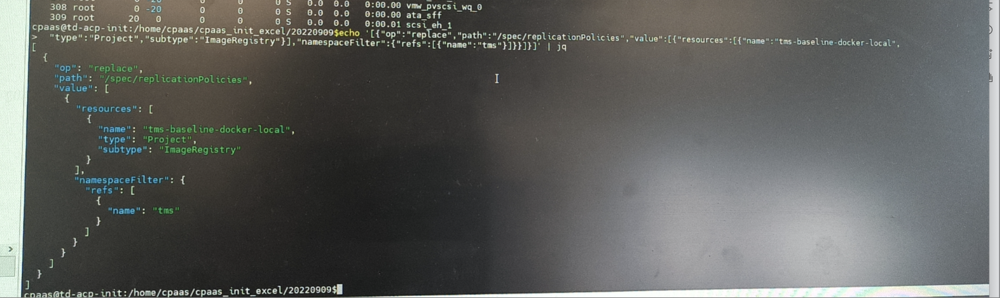

---
kind:
  - Troubleshooting
products:
  - Alauda Container Platform
  - Alauda DevOps
  - Alauda AI
  - Alauda Application Services
  - Alauda Service Mesh
  - Alauda Developer Portal
ProductsVersion:
  - 4.1.0,4.2.x
---
<!-- A type of document that involves encountering a fault, diagnosing it, performing root cause analysis, and providing solutions. -->

# maven制品仓库分配项目报错

制品库分配项目报错 请求结构体不正确 停用tenant组件后故障消失

## Cause
- tenant组件修改了URL导致请求被错误路由或处理

## Resolution
- 停用tenant组件（移除相关ingress）

## [workaround]

## [Related Information]
**Screenshots**

- Environment: TKE 3.8
- tenant组件
- katanomi-api controller plugin
- ingress配置
- 项目yaml配置
- Component: Ingress NGINX
- Page ID: 130576229
- Original Title: maven制品仓库分配项目报错
