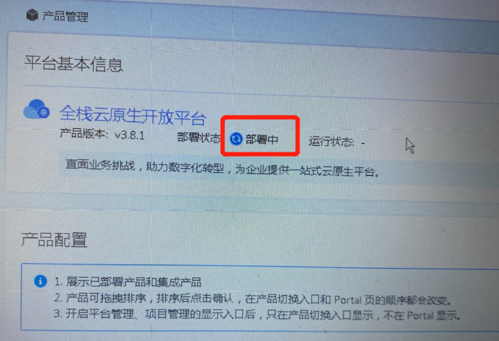
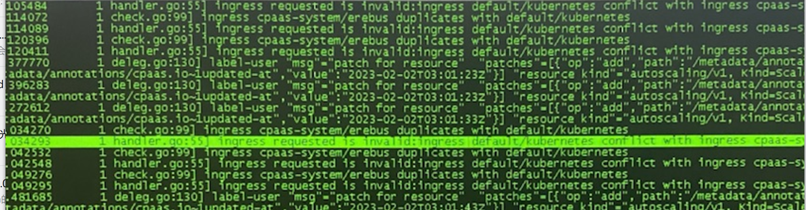
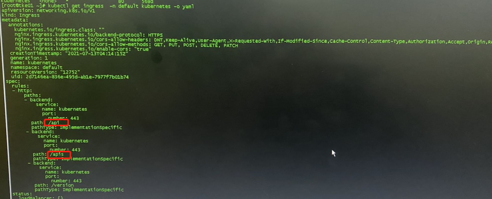
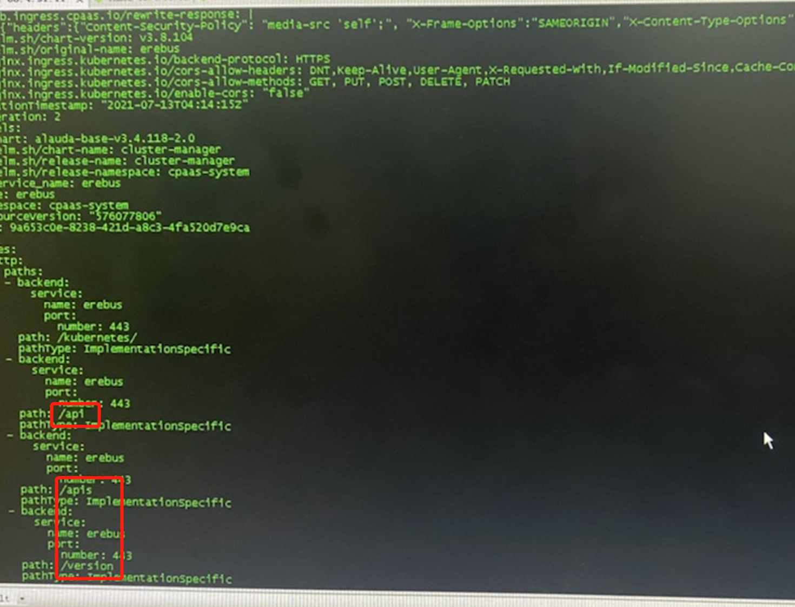

---
kind:
  - Troubleshooting
products:
  - Alauda Container Platform
  - Alauda DevOps
  - Alauda AI
  - Alauda Application Services
  - Alauda Service Mesh
  - Alauda Developer Portal
ProductsVersion:
  - 4.1.0,4.2.x
---
<!-- A type of document that involves encountering a fault, diagnosing it, performing root cause analysis, and providing solutions. -->

# 3.8.1 平台界面

产品管理位置提示部署中 erebus ingress初始化失败 日志显示ingress资源存在冲突

## Cause
- default命名空间存在与erebus ingress相同路径的路由

## Resolution
- kubectl delete ingress -n default kubernetes

## [workaround]

## [Related Information]
**Screenshots**

- Environment: 3.8.1
- ingress资源
- erebus服务
- default命名空间
- kubernetes ingress名称
- Component: Ingress NGINX
- Page ID: 136528840
- Original Title: 3.8.1 平台界面-产品管理位置提示部署中
