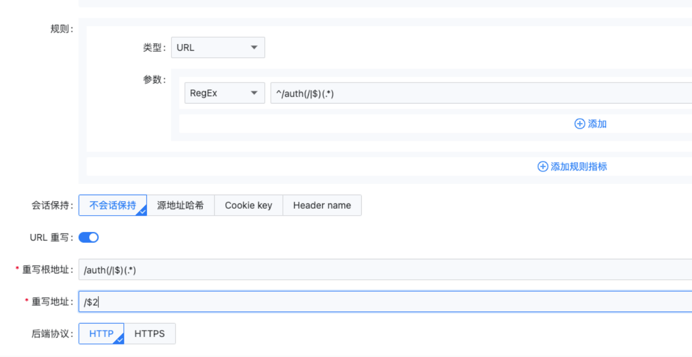

---
kind:
  - Troubleshooting
products:
  - Alauda Container Platform
  - Alauda DevOps
  - Alauda AI
  - Alauda Application Services
  - Alauda Service Mesh
  - Alauda Developer Portal
ProductsVersion:
  - 4.1.0,4.2.x
---
<!-- A type of document that involves encountering a fault, diagnosing it, performing root cause analysis, and providing solutions. -->

# 通过alb或ingress如何配置URL重写

## 环境信息 适用版本：通用

## Cause

## Resolution
- 通过alb配置URL重写，配置方法参考图示
- 通过ingress入站规则配置方法：

apiVersion: networking.k8s.io/v1
kind: Ingress
metadata:
    nginx.ingress.kubernetes.io/rewrite-target: /$2
  name: test-ing
  namespace: cpaas-system
spec:
  rules:
  - http:
      paths:
      - backend:
          service:
            name: test
            port:
              number: 8080
        path: /auth(/|$)(.*)
        pathType: ImplementationSpecific

## [workaround]

## [Related Information]
**Screenshots**

- Environment: 通用
- nginx.ingress.kubernetes.io/rewrite-target
- /auth(/|$)(.*)
- test
- 8080
- ImplementationSpecific
- Component: Ingress NGINX
- Page ID: 161393192
- Original Title: 通过alb或ingress如何配置URL重写
