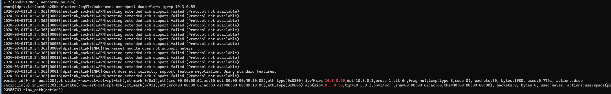

---
kind:
  - Troubleshooting
products:
  - Alauda Container Platform
  - Alauda DevOps
  - Alauda AI
  - Alauda Application Services
  - Alauda Service Mesh
  - Alauda Developer Portal
ProductsVersion:
  - 4.1.0,4.2.x
---
<!-- A type of document that involves encountering a fault, diagnosing it, performing root cause analysis, and providing solutions. -->

# overlay网络pod创建失败no packet receive from gateway 10.0.3.1

Pod创建失败，无法从网关10.0.3.1接收数据包 Pod内ping网关10.3.0.1可解析ARP但无ICMP响应 ovs datapath直接丢弃ICMP请求

## Cause
- 升级后ovs-ovn组件异常导致datapath流量处理异常

## Resolution
- 重启ovs-ovn pod恢复datapath功能

## [workaround]
- 临时重启ovs-ovn pod

## [Related Information]
**Screenshots**

- Environment: Kubernetes集群从ACP3.14.2升级到3.16，CNI版本kubeovn:v1.12.8
- kubeovn
- ovn-central
- ovn-cluster
- ovn-default
- kubectl ko trace
- ovn-trace
- ovs-appctl ofproto/trace
- Component: Ingress NGINX
- Page ID: 194052445
- Original Title: overlay网络pod创建失败no packet receive from gateway 10.0.3.1
