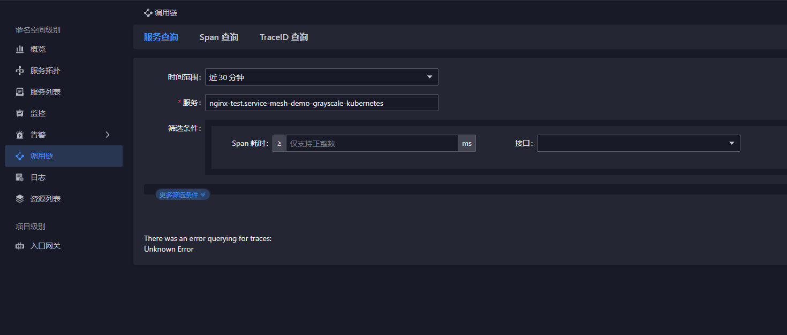
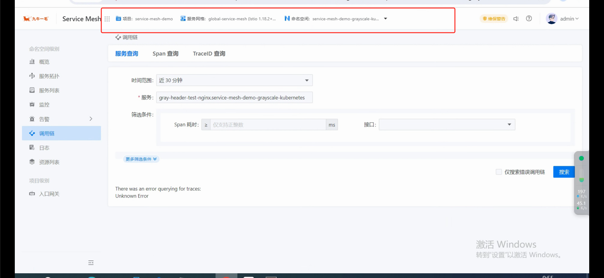
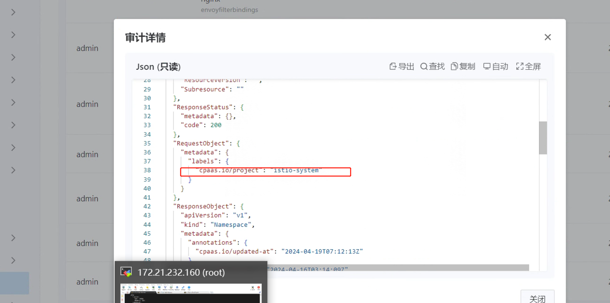
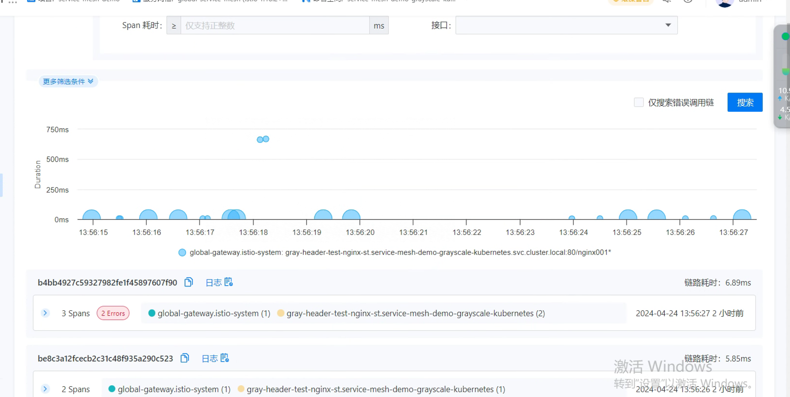
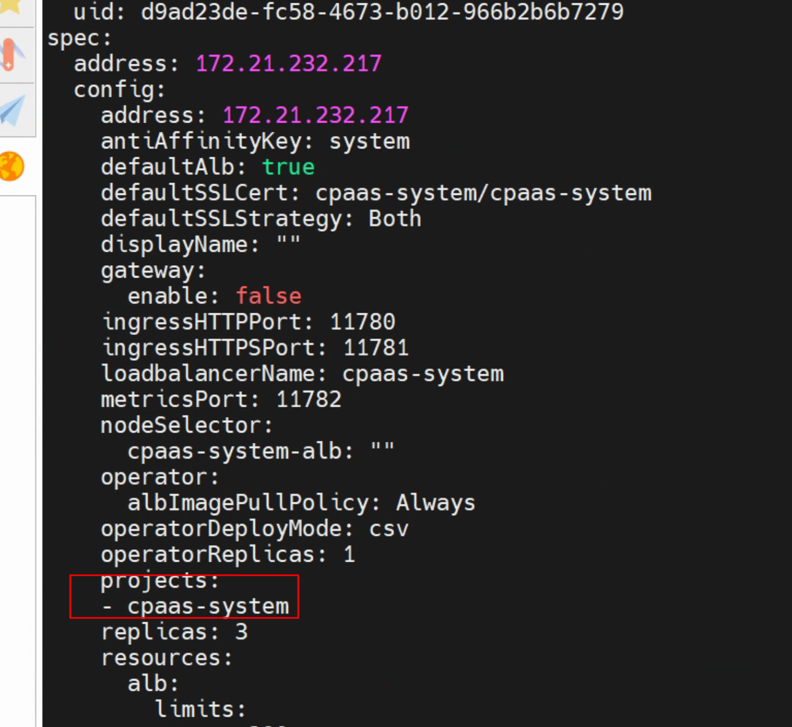

---
kind:
  - Troubleshooting
products:
  - Alauda Container Platform
  - Alauda DevOps
  - Alauda AI
  - Alauda Application Services
  - Alauda Service Mesh
  - Alauda Developer Portal
ProductsVersion:
  - 4.1.0,4.2.x
---
<!-- A type of document that involves encountering a fault, diagnosing it, performing root cause analysis, and providing solutions. -->

# 服务网格中调用链无法查询到数据

调用链无法获取数据 Jaeger查询页面返回404

## Cause
- istio-system命名空间的项目标签被修改

## Resolution
- 恢复istio-system命名空间的项目标签为cpaas-system

## [workaround]

## [Related Information]
**Screenshots**

- Environment: 3.12.1
- istio-system命名空间
- 项目标签
- alb
- ingress规则同步
- cpaas-system
- Component: Ingress NGINX
- Page ID: 204507950
- Original Title: 微服务-服务网格中调用链无法查询到数据-78270
