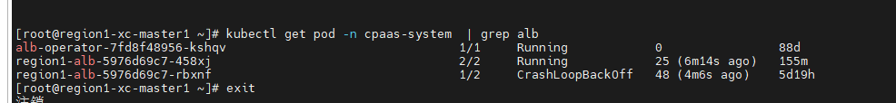
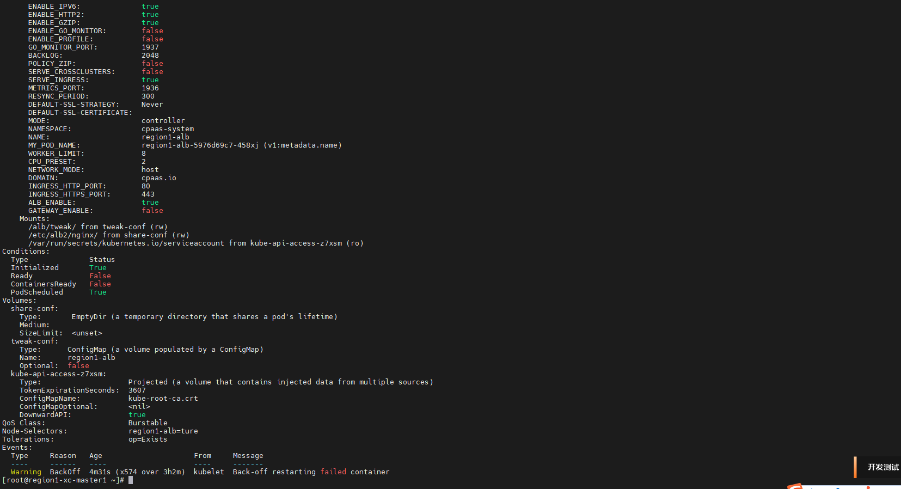
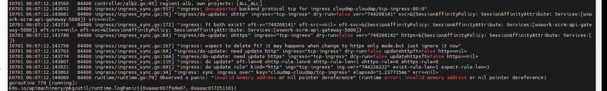
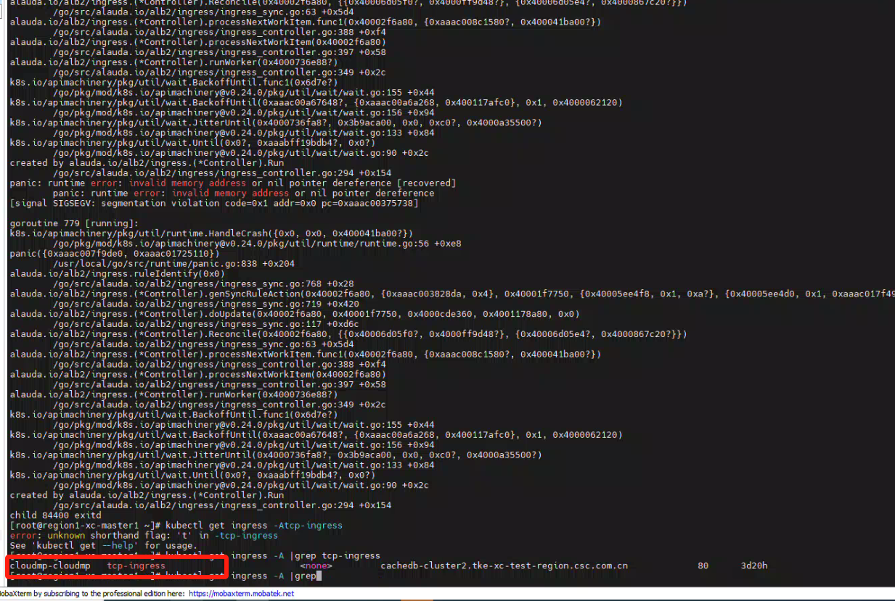

---
kind:
  - Troubleshooting
products:
  - Alauda Container Platform
  - Alauda DevOps
  - Alauda AI
  - Alauda Application Services
  - Alauda Service Mesh
  - Alauda Developer Portal
ProductsVersion:
  - 4.1.0,4.2.x
---
<!-- A type of document that involves encountering a fault, diagnosing it, performing root cause analysis, and providing solutions. -->

# alb服务pod启动失败

alb服务pod启动失败 alb2容器日志中加载'tcp-ingress'ingress规则时报错

## Cause
- 在cloudmp-cloudmp命名空间下创建了平台不支持的TCP类型ingress规则

## Resolution
- 删除冲突的tcp-ingress规则

## [workaround]

## [Related Information]
**Screenshots**

- Environment: 3.12
- alb2容器
- ingress规则
- cloudmp-cloudmp命名空间
- tcp-ingress
- Component: Ingress NGINX
- Page ID: 221873298
- Original Title: alb服务pod启动失败-创建平台侧不支持的ingress规则导致
