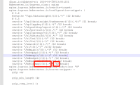
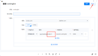

---
kind:
  - Troubleshooting
products:
  - Alauda Container Platform
  - Alauda DevOps
  - Alauda AI
  - Alauda Application Services
  - Alauda Service Mesh
  - Alauda Developer Portal
ProductsVersion:
  - 4.1.0,4.2.x
---
<!-- A type of document that involves encountering a fault, diagnosing it, performing root cause analysis, and providing solutions. -->

# 客户侧ingress资源导入平台入站规则改造示例

平台侧ALB无法直接支持客户原生Ingress的annotations配置 大量rewrite规则在单一Ingress中无法生效

## Cause
- 使用了非平台支持的annotations: nginx.ingress.kubernetes.io/configuration-snippet
- 使用了非平台支持的annotations: nginx.ingress.kubernetes.io/server-snippet
- 使用了非平台支持的annotations: nginx.ingress.kubernetes.io/use-regex
- 未正确设置kubernetes.io/ingress.class为平台负载均衡名称

## Resolution
- 通过ConfigMap配置全局nginx设置：apiVersion: v1 kind: ConfigMap metadata: name: beidou-crm-new
- ALB配置中引用ConfigMap：spec.config.overwrite.configmap: - name: cpaas-system/beidou-crm-new
- 拆分Ingress规则为独立条目并添加注解：nginx.ingress.kubernetes.io/rewrite-target: /$2

## [workaround]
- 将复合rewrite规则拆分为独立Ingress规则

## [Related Information]
**Screenshots**

- Environment: ACP 3.14
- nginx.ingress.kubernetes.io/configuration-snippet
- nginx.ingress.kubernetes.io/server-snippet
- nginx.ingress.kubernetes.io/use-regex
- beidou.dev.laiyifen.com
- port:8080-8089
- alb-new.yaml
- Component: Ingress NGINX
- Page ID: 229836863
- Original Title: 客户侧ingress资源导入平台入站规则改造示例
