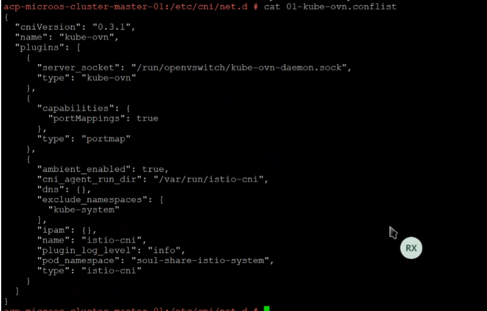

---
kind:
  - Troubleshooting
products:
  - Alauda Container Platform
  - Alauda DevOps
  - Alauda AI
  - Alauda Application Services
  - Alauda Service Mesh
  - Alauda Developer Portal
ProductsVersion:
  - 4.1.0,4.2.x
---
<!-- A type of document that involves encountering a fault, diagnosing it, performing root cause analysis, and providing solutions. -->

# ingress

ingress-controller 部署状态异常

## Cause
- /etc/cni/net.d 存在旧版multis插件残留
- OVN插件存在其他辅助插件残留

## Resolution
- 删除/etc/cni/net.d目录下的残留文件
- 移除OVN插件上的其他辅助插件
- 执行热加载恢复操作

## [workaround]

## [Related Information]
**Screenshots**

- Environment: 4.0.3
- /etc/cni/net.d
- multis插件
- OVN插件
- Component: Ingress NGINX
- Page ID: 339444006
- Original Title: 容器平台-网络-ALB-ingress-controller 部署状态异常-1956
