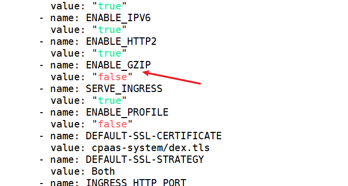

---
kind:
  - Troubleshooting
products:
  - Alauda Container Platform
  - Alauda DevOps
  - Alauda AI
  - Alauda Application Services
  - Alauda Service Mesh
  - Alauda Developer Portal
ProductsVersion:
  - 4.1.0,4.2.x
---
<!-- A type of document that involves encountering a fault, diagnosing it, performing root cause analysis, and providing solutions. -->

# 3.6

JIRA Jira：

## Cause

## Resolution
- 修改对应负载均衡deployment的GZIP配置参数为false

## [workaround]

## [Related Information]
**Screenshots**

- Environment: 3.6
- 负载均衡deployment
- GZIP
- Component: ALB
- Page ID: 101651302
- Original Title: 3.6-容器平台-alb-alb配置关闭nginx的gzip功能
