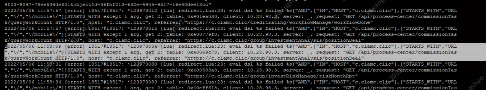
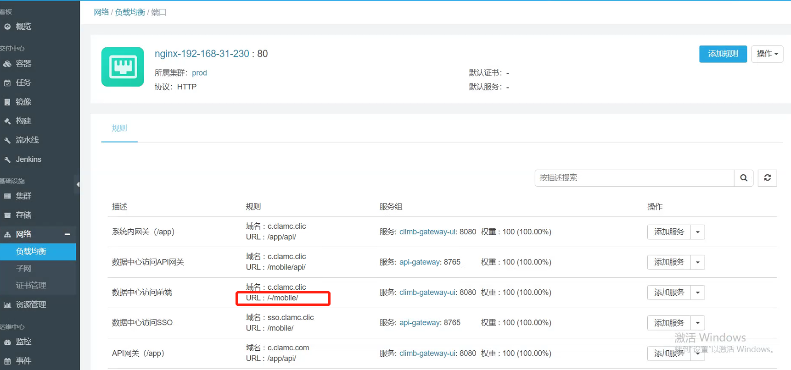
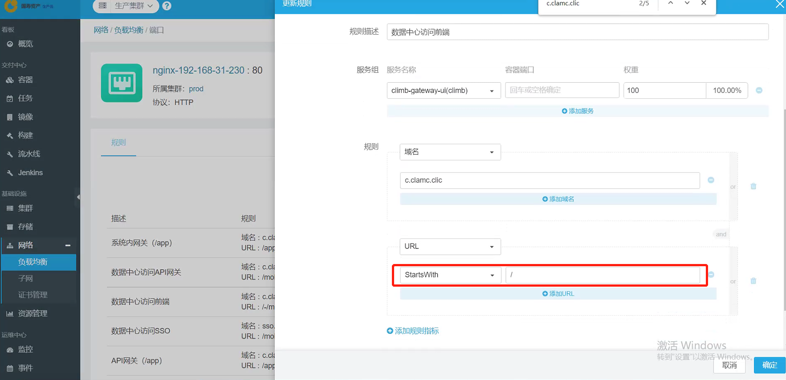
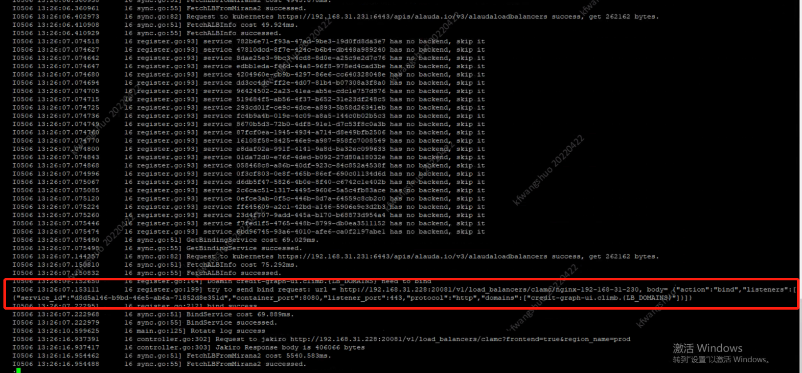
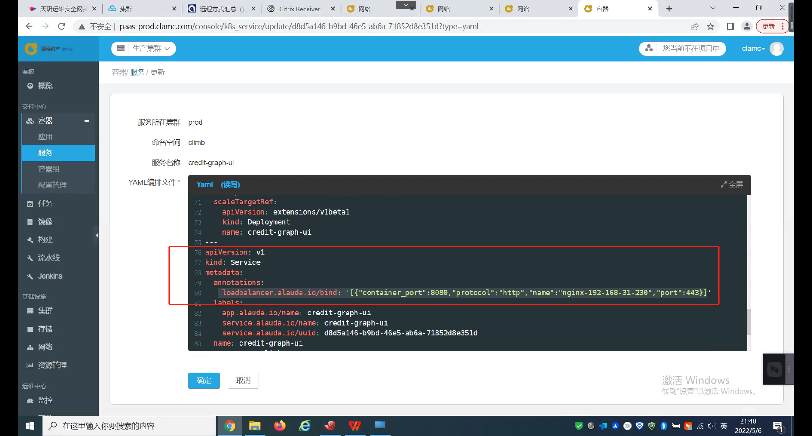

---
kind:
  - Troubleshooting
products:
  - Alauda Container Platform
  - Alauda DevOps
  - Alauda AI
  - Alauda Application Services
  - Alauda Service Mesh
  - Alauda Developer Portal
ProductsVersion:
  - 4.1.0,4.2.x
---
<!-- A type of document that involves encountering a fault, diagnosing it, performing root cause analysis, and providing solutions. -->

# 1.13.3

新增端口未被监听，如12060端口未生效 手动创建监听端口后未被加载 nginx error.log显示频繁加载某条规则导致阻塞

## Cause
- 存在异常规则导致负载均衡配置加载阻塞
- 服务annotation配置错误（http协议绑定到443端口）

## Resolution
- 删除界面中的异常规则
- 修正异常服务的annotation配置：删除错误配置后重新绑定443端口
- 重启alb容器

## [workaround]

## [Related Information]
**Screenshots**

- Environment: 1.13.3
- 12060
- 443
- /var/log/mathilde/miranda2.ERROR
- alb容器
- nginx
- annotation配置
- Component: ALB
- Page ID: 115511113
- Original Title: 1.13.3-alb无法识别新增端口
