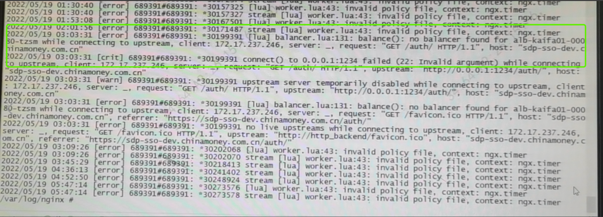
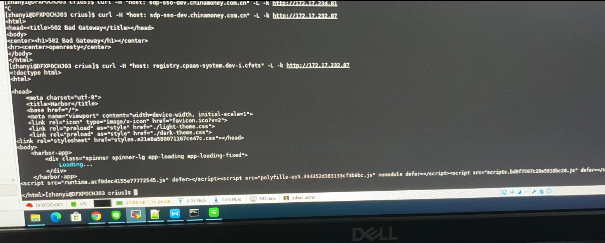

---
kind:
  - Troubleshooting
products:
  - Alauda Container Platform
  - Alauda DevOps
  - Alauda AI
  - Alauda Application Services
  - Alauda Service Mesh
  - Alauda Developer Portal
ProductsVersion:
  - 4.1.0,4.2.x
---
<!-- A type of document that involves encountering a fault, diagnosing it, performing root cause analysis, and providing solutions. -->

# alb无法转发至后端服务

无法访问 alb2 error.log中有报错no balancer found for

## Cause
- 后端服务svc.type使用了LoadBalancer类型
- alb设计不支持LoadBalancer类型服务

## Resolution
- 将svc.type修改为ClusterIP

## [workaround]

## [Related Information]
**Screenshots**

- Environment: 通用版本
- alb2
- svc.type
- ClusterIP
- LoadBalancer
- 内部路由
- Component: alb
- Page ID: 115528029
- Original Title: alb无法转发至后端服务
