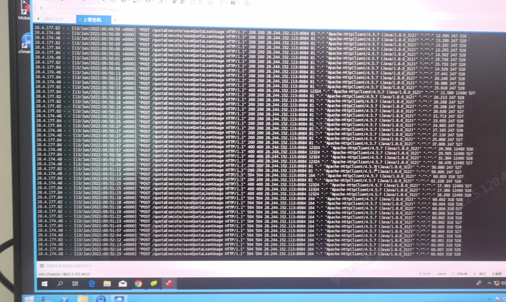

---
kind:
  - Troubleshooting
products:
  - Alauda Container Platform
  - Alauda DevOps
  - Alauda AI
  - Alauda Application Services
  - Alauda Service Mesh
  - Alauda Developer Portal
ProductsVersion:
  - 4.1.0,4.2.x
---
<!-- A type of document that involves encountering a fault, diagnosing it, performing root cause analysis, and providing solutions. -->

# 压测

压测时返回504 gateway timeout 业务容器CPU在压测时维持100% ALB日志中存在大量400报错

## Cause
- 业务容器处理异常导致超过ALB超时时间
- 业务容器存在400报错

## Resolution
- 业务容器侧处理400报错
- 优化业务容器处理性能

## [workaround]

## [Related Information]
**Screenshots**

- Environment: 容器部署，通过平台alb进行服务暴露
- alb
- kubectl get cm -n (alb所在命名空间)
- timeout相关超时参数
- 业务容器
- Component: alb
- Page ID: 115533878
- Original Title: 压测-通过alb进行业务暴露-返回504 gateway timeout
