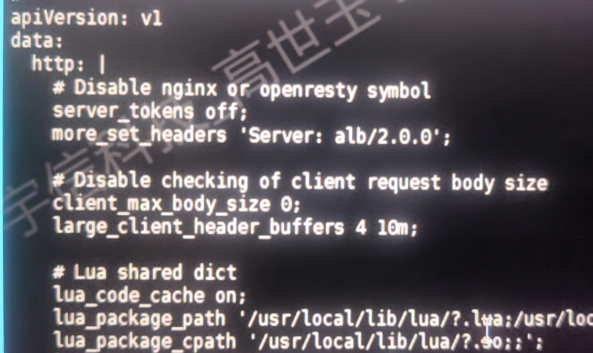

---
kind:
  - Troubleshooting
products:
  - Alauda Container Platform
  - Alauda DevOps
  - Alauda AI
  - Alauda Application Services
  - Alauda Service Mesh
  - Alauda Developer Portal
ProductsVersion:
  - 4.1.0,4.2.x
---
<!-- A type of document that involves encountering a fault, diagnosing it, performing root cause analysis, and providing solutions. -->

# 业务请求头过大，alb报错400

业务请求头过大，alb报错400

## Cause
- 默认配置参数请求头限制为10k

## Resolution
- 修改alb同名的configmap，在http下添加 large_client_header_buffers 4 10m;

## [workaround]

## [Related Information]
**Screenshots**

- Environment: 通用
- alb
- configmap
- large_client_header_buffers
- Component: alb
- Page ID: 119084778
- Original Title: 业务请求头过大，alb报错400
