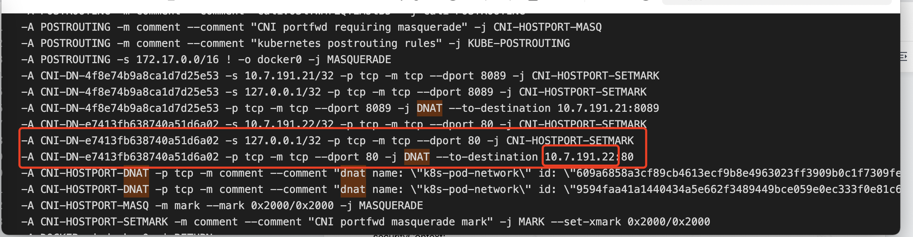
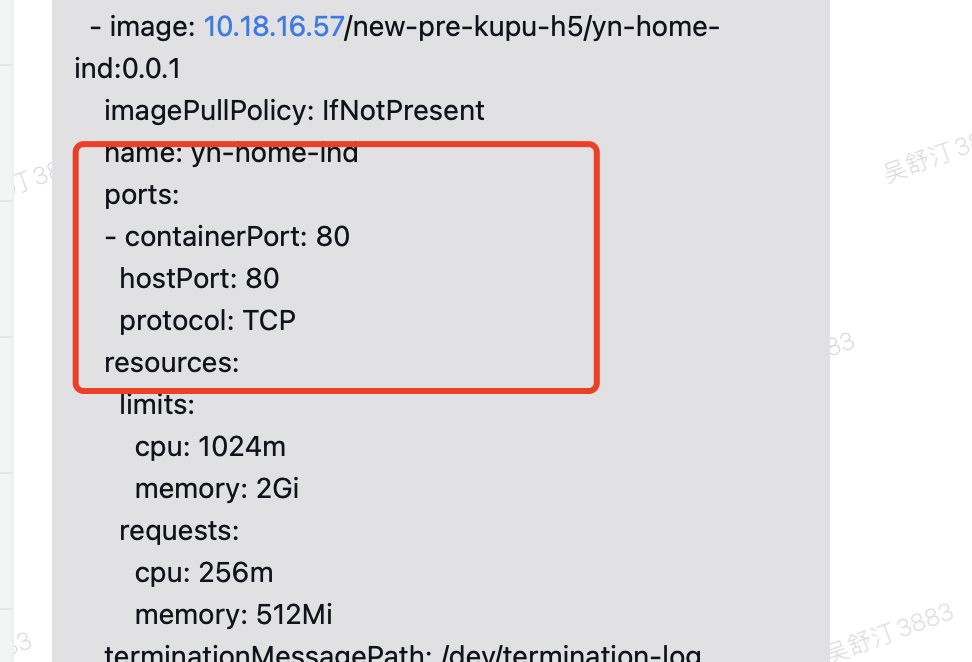

---
kind:
  - Troubleshooting
products:
  - Alauda Container Platform
  - Alauda DevOps
  - Alauda AI
  - Alauda Application Services
  - Alauda Service Mesh
  - Alauda Developer Portal
ProductsVersion:
  - 4.1.0,4.2.x
---
<!-- A type of document that involves encountering a fault, diagnosing it, performing root cause analysis, and providing solutions. -->

# 业务应用开启hostPort导致alb端口异常

alb 80端口不通 telnet localhost 80正常，127.0.0.1和本机ip 80不通 iptables-save显示10.7.191.22 dport:80流量被伪装到CNI-HOSTPORT

## Cause
- 业务Pod配置了hostPort: 80，占用alb监听端口

## Resolution
- 改用alb暴露服务或hostNetwork方式暴露，避免使用hostPort

## [workaround]

## [Related Information]
**Screenshots**

- Environment: 通用
- hostPort
- alb
- iptables
- CNI-HOSTPORT
- Component: alb
- Page ID: 120110197
- Original Title: 业务应用开启hostPort导致alb端口异常
