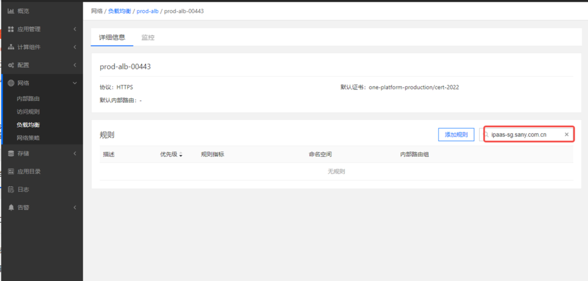
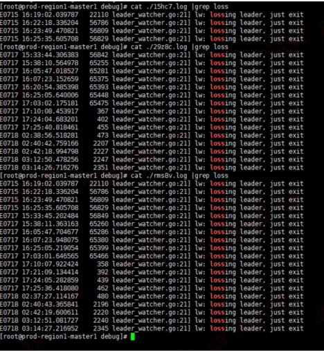

---
kind:
  - Troubleshooting
products:
  - Alauda Container Platform
  - Alauda DevOps
  - Alauda AI
  - Alauda Application Services
  - Alauda Service Mesh
  - Alauda Developer Portal
ProductsVersion:
  - 4.1.0,4.2.x
---
<!-- A type of document that involves encountering a fault, diagnosing it, performing root cause analysis, and providing solutions. -->

# alb的https规则被自动删除

https规则被自动删除 审计日志无删除记录 alb的debug日志显示脑裂

## Cause
- etcd存储性能差导致异常
- alb发生脑裂

## Resolution
- 迁移etcd存储

## [workaround]
- 重启alb实例

## [Related Information]
**Screenshots**

- Environment: 3.4.2
- alb
- etcd
- ingress
- https规则
- alb日志
- etcd存储配置
- Component: alb
- Page ID: 124682454
- Original Title: alb的https规则被自动删除
