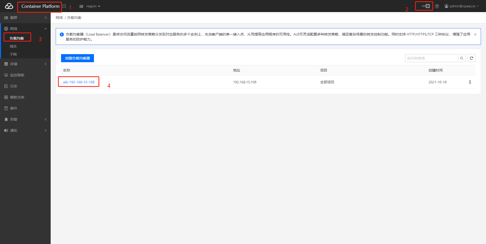
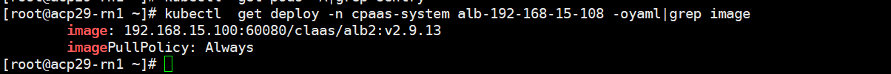
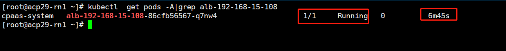
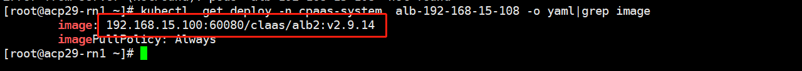

---
kind:
  - Troubleshooting
products:
  - Alauda Container Platform
  - Alauda DevOps
  - Alauda AI
  - Alauda Application Services
  - Alauda Service Mesh
  - Alauda Developer Portal
ProductsVersion:
  - 4.1.0,4.2.x
---
<!-- A type of document that involves encountering a fault, diagnosing it, performing root cause analysis, and providing solutions. -->

# 2.9更新alb镜像方法

alb pod未正常重新拉起 alb组件镜像版本未更新 sentry同步组件未停止导致同步问题

## Cause
- 旧版本镜像未正确替换
- 新镜像未成功上传到仓库
- sentry组件仍在运行导致配置冲突

## Resolution
- kubectl scale deploy -n cpaas-system sentry --replicas=0
- docker load -i albv2.9.14.tar && docker tag && docker push
- kubectl set image deployment -n cpaas-system alb-192-168-15-108 \*=192.168.15.100:60080/claas/alb2:v2.9.14
- kubectl get pods -A|grep alb-192-168-15-108 验证pod状态
- kubectl get deploy -n cpaas-system alb-192-168-15-108 -o yaml|grep image 确认镜像版本

## [workaround]

## [Related Information]
**Screenshots**

- Environment: 2.9
- sentry部署
- alb-192-168-15-108部署
- 192.168.15.100:60080镜像仓库
- kubectl scale
- kubectl set image
- Component: alb
- Page ID: 124700239
- Original Title: 2.9更新alb镜像方法
