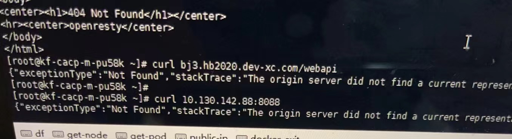
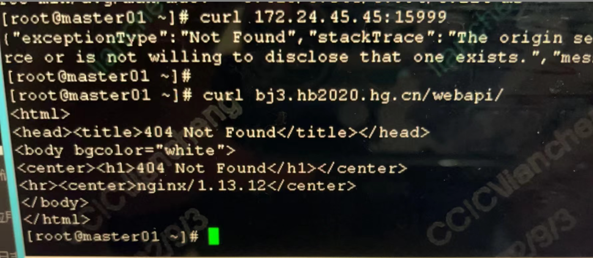
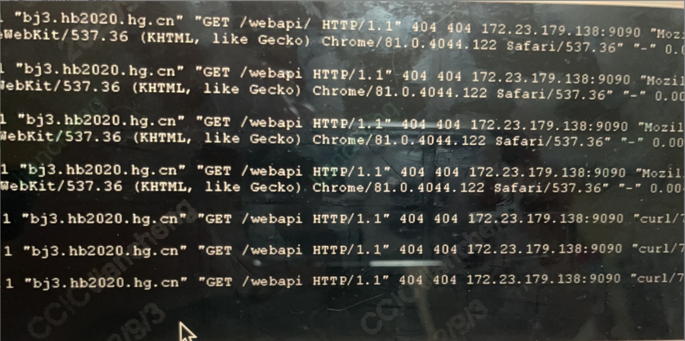
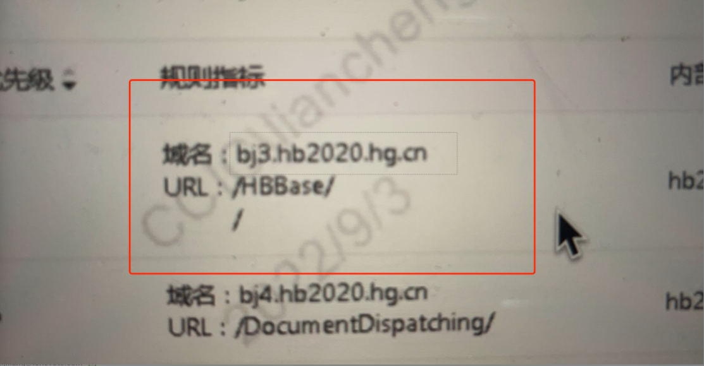

---
kind:
  - Troubleshooting
products:
  - Alauda Container Platform
  - Alauda DevOps
  - Alauda AI
  - Alauda Application Services
  - Alauda Service Mesh
  - Alauda Developer Portal
ProductsVersion:
  - 4.1.0,4.2.x
---
<!-- A type of document that involves encountering a fault, diagnosing it, performing root cause analysis, and providing solutions. -->

# alb访问规则404

访问ALB规则返回404 直接访问SVC和EP地址+端口返回正确内容 应用存在/webapi接口但ALB返回不一致

## Cause
- ALB路径规则优先级配置不当
- /webapi和/路径规则优先级相同导致错误匹配

## Resolution
- 调整/webapi规则的优先级大于/路径规则

## [workaround]

## [Related Information]
**Screenshots**

- Environment: TKE 3.6.1
- /webapi
- /
- 9090端口
- alb log-sidecar
- svc
- ep
- 路径优先级配置
- Component: alb
- Page ID: 130563124
- Original Title: alb访问规则404
