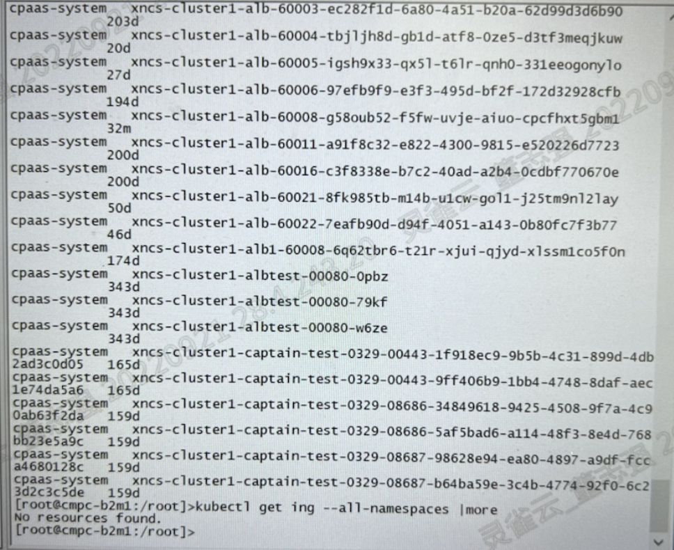

---
kind:
  - Troubleshooting
products:
  - Alauda Container Platform
  - Alauda DevOps
  - Alauda AI
  - Alauda Application Services
  - Alauda Service Mesh
  - Alauda Developer Portal
ProductsVersion:
  - 4.1.0,4.2.x
---
<!-- A type of document that involves encountering a fault, diagnosing it, performing root cause analysis, and providing solutions. -->

# alb持续重启

ALB总是重启 alb日志报错索引长度超过限制

## Cause
- ft资源中配置了不存在的certificate_name

## Resolution
- 更改ft资源中异常的certificate_name为空或正常存在的值

## [workaround]

## [Related Information]
**Screenshots**

- Environment: 2.6
- alb.networking.cpaas.io/tls
- ft资源
- certificate_name
- Component: alb
- Page ID: 130576876
- Original Title: alb持续重启
