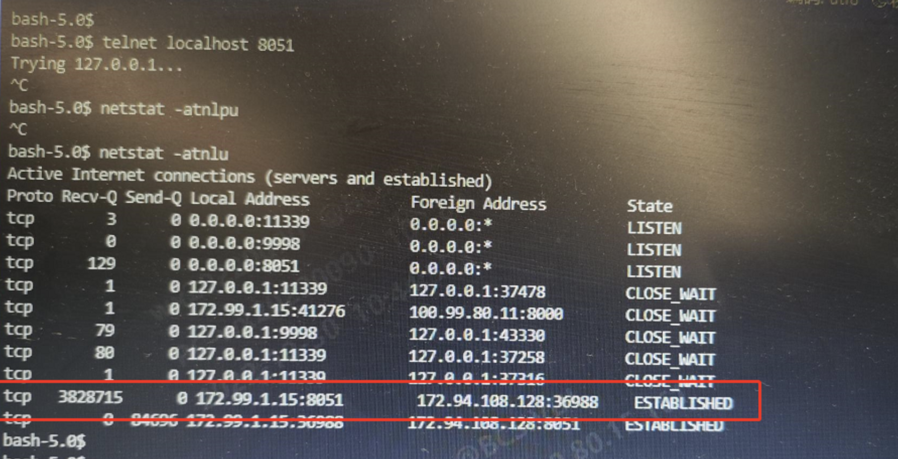

---
kind:
  - Troubleshooting
products:
  - Alauda Container Platform
  - Alauda DevOps
  - Alauda AI
  - Alauda Application Services
  - Alauda Service Mesh
  - Alauda Developer Portal
ProductsVersion:
  - 4.1.0,4.2.x
---
<!-- A type of document that involves encountering a fault, diagnosing it, performing root cause analysis, and providing solutions. -->

# alb内存持续上升并至gc

内存使用率持续上升至99%触发GC 每个周期8小时 3个alb pod均呈现相同规律

## Cause
- 异常后端服务节点存在RecvQ堆积
- 业务应用8051端口假死导致alb连接异常

## Resolution
- 摘除存在异常的后端服务规则

## [workaround]

## [Related Information]
**Screenshots**

- Environment: TKE 3.6.2双架构(从3.6.1升级)
- 8051端口
- alb后端服务规则
- RecvQ
- Component: alb
- Page ID: 133083506
- Original Title: alb内存持续上升并至gc
