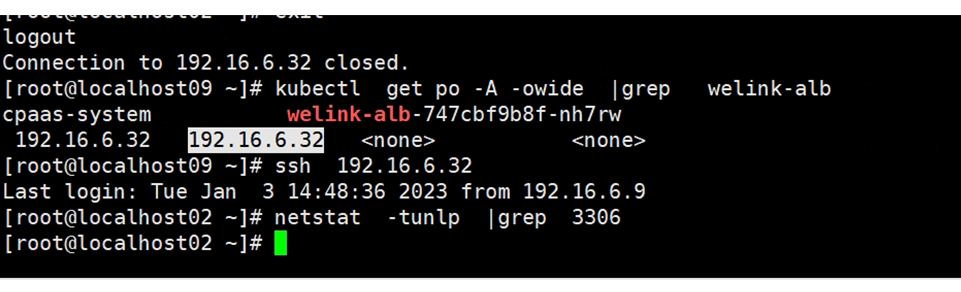

---
kind:
  - Troubleshooting
products:
  - Alauda Container Platform
  - Alauda DevOps
  - Alauda AI
  - Alauda Application Services
  - Alauda Service Mesh
  - Alauda Developer Portal
ProductsVersion:
  - 4.1.0,4.2.x
---
<!-- A type of document that involves encountering a fault, diagnosing it, performing root cause analysis, and providing solutions. -->

# 3.10.1

在alb下创建TCP 3306端口后主机未监听 重启alb组件后所有端口均未监听 alb日志显示1936端口占用

## Cause
- 客户创建的1936端口与alb指标端口冲突

## Resolution
- 删除客户创建的1936端口

## [workaround]

## [Related Information]
**Screenshots**

- Environment: alb
- alb组件
- 1936端口
- nginx日志
- netstat -nlp
- Component: alb
- Page ID: 133094340
- Original Title: 3.10.1-新增alb端口主机上监听失败
