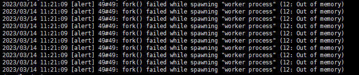
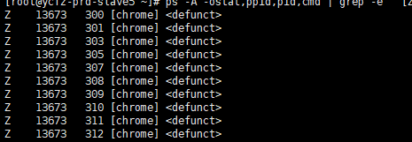

---
kind:
  - Troubleshooting
products:
  - Alauda Container Platform
  - Alauda DevOps
  - Alauda AI
  - Alauda Application Services
  - Alauda Service Mesh
  - Alauda Developer Portal
ProductsVersion:
  - 4.1.0,4.2.x
---
<!-- A type of document that involves encountering a fault, diagnosing it, performing root cause analysis, and providing solutions. -->

# alb转发异常,日志报错” fork() failed while spawning "worker process" (12: Out of memory)“

alb转发异常 error日志报错'fork() failed while spawning "worker process" (12: Out of memory)' docker执行命令卡死

## Cause
- 应用程序存在线程泄漏
- 僵尸进程占用大量主机线程导致系统资源耗尽

## Resolution
- 重启主机临时恢复
- 修复应用程序线程泄漏问题

## [workaround]
- 重启主机

## [Related Information]
**Screenshots**

- Environment: 通用
- chrome进程
- docker命令
- 线程泄漏
- fork()
- Component: alb
- Page ID: 140814187
- Original Title: alb转发异常,日志报错” fork() failed while spawning "worker process" (12: Out of memory)“
