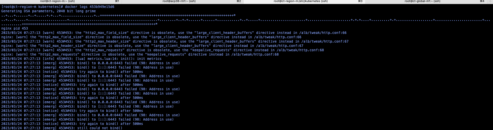
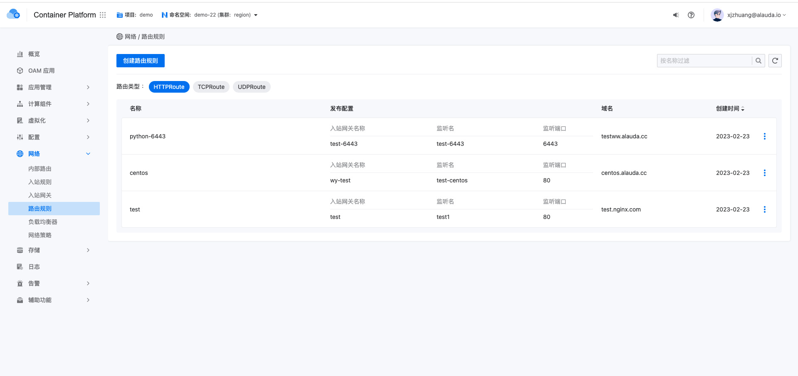

---
kind:
  - Troubleshooting
products:
  - Alauda Container Platform
  - Alauda DevOps
  - Alauda AI
  - Alauda Application Services
  - Alauda Service Mesh
  - Alauda Developer Portal
ProductsVersion:
  - 4.1.0,4.2.x
---
<!-- A type of document that involves encountering a fault, diagnosing it, performing root cause analysis, and providing solutions. -->

# cpaas

alb-cpaas-system pod无法启动 6443端口被占用报错

## Cause
- 存在gateway路由规则占用了6443端口

## Resolution
- 1. 执行 kubectl get gateway -A 查询占用端口的规则
- 2. 删除占用6443端口的gateway路由规则
- 3. 重启alb pod

## [workaround]

## [Related Information]
**Screenshots**

- Environment: 3.10.2
- gateway
- alb-cpaas-system
- 6443端口
- Component: alb
- Page ID: 140824678
- Original Title: alb-cpaas-system pod无法启动
