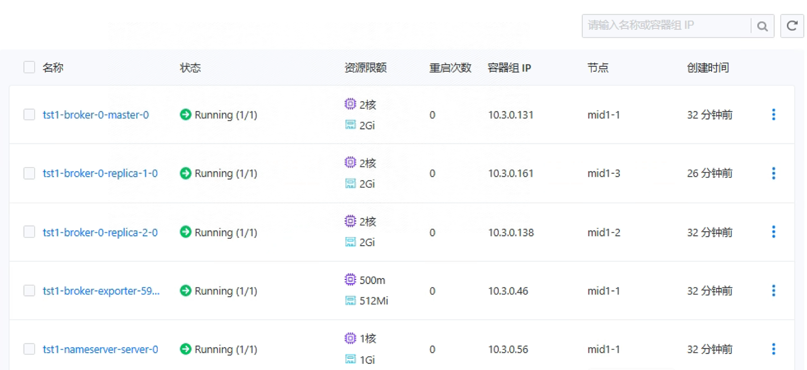
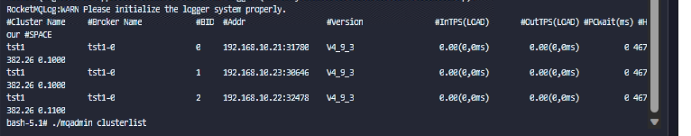

---
kind:
  - Troubleshooting
products:
  - Alauda Container Platform
  - Alauda DevOps
  - Alauda AI
  - Alauda Application Services
  - Alauda Service Mesh
  - Alauda Developer Portal
ProductsVersion:
  - 4.1.0,4.2.x
---
<!-- A type of document that involves encountering a fault, diagnosing it, performing root cause analysis, and providing solutions. -->

# rockmq数据节点迁移方案

需要移除Broker节点

## Cause
- Broker节点维护或迁移需求

## Resolution
- 停止要移除的Broker节点：登录对应节点容器执行`./mqshutdown broker`
- 通过NameServer控制台删除节点：访问`http://nameserver-ip:8080`，在Broker管理中删除目标节点
- 或修改`conf/broker.conf`，从`brokerClusterName`中移除节点地址，并重启NameServer及其他Broker节点
- 使用`bin/mqadmin clusterList`检查集群状态

## [workaround]

## [Related Information]
**Screenshots**

- NameServer控制台
- broker.conf
- mqadmin
- brokerClusterName
- 8080端口
- Component: ALB
- Page ID: 146351544
- Original Title: 数据服务-rockmq数据节点迁移方案
