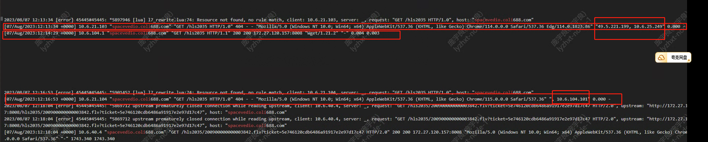

---
kind:
  - Troubleshooting
products:
  - Alauda Container Platform
  - Alauda DevOps
  - Alauda AI
  - Alauda Application Services
  - Alauda Service Mesh
  - Alauda Developer Portal
ProductsVersion:
  - 4.1.0,4.2.x
---
<!-- A type of document that involves encountering a fault, diagnosing it, performing root cause analysis, and providing solutions. -->

# alb暴漏域名通过客户侧代理公网访问报错404

公网浏览器请求返回404 内网浏览器不配置hosts解析走代理报错404 集群节点本地或内网配置hosts解析后请求返回200

## Cause
- 客户侧代理存在证书认证与ALB暴露侧域名配置冲突
- 代理转发策略导致请求无法正确路由

## Resolution
- 关闭客户侧代理的证书认证
- 平台侧整体调整为80端口暴露

## [workaround]

## [Related Information]
**Screenshots**

- Environment: 3.10.2
- alb
- albF5VIP
- 代理服务器配置
- 域名解析
- 80/443端口
- Component: alb
- Page ID: 155332810
- Original Title: alb暴漏域名通过客户侧代理公网访问报错404
