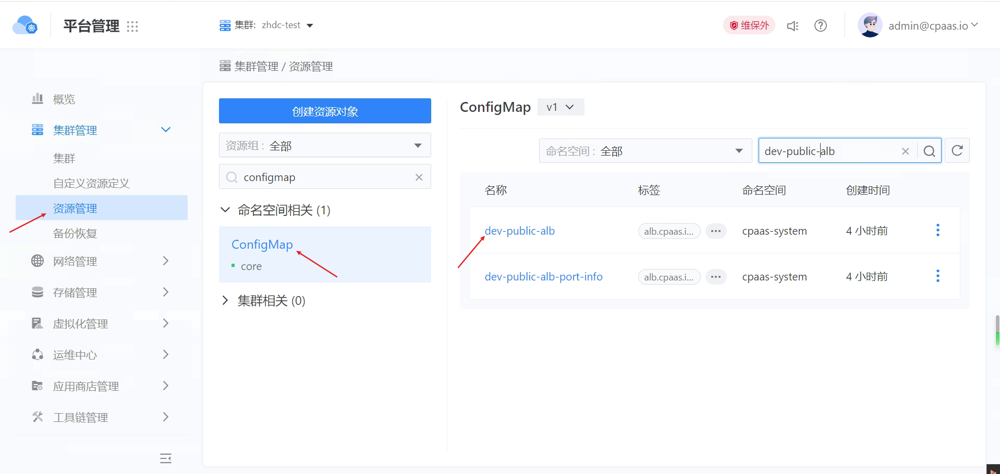

---
kind:
  - Troubleshooting
products:
  - Alauda Container Platform
  - Alauda DevOps
  - Alauda AI
  - Alauda Application Services
  - Alauda Service Mesh
  - Alauda Developer Portal
ProductsVersion:
  - 4.1.0,4.2.x
---
<!-- A type of document that involves encountering a fault, diagnosing it, performing root cause analysis, and providing solutions. -->

# 3.10以后至3.18如何修改业务alb的nginx配置

## 环境信息 适用版本：3.10以后-3.18

## Cause

## Resolution
- 查找当前ALB的Nginx ConfigMap名称
- 创建新ConfigMap并保留name/namespace字段，命名格式为<alb name>-cm-update
- 修改ConfigMap内容（如超时时间配置）
- 在ALB资源的spec.config.overwrite.configmap字段引用新ConfigMap
- 后续更新时直接修改现有ConfigMap并触发ALB资源同步（通过添加annotation等方式）

## [workaround]

## [Related Information]
**Screenshots**

- Environment: 3.10以后-3.18
- ConfigMap
- ALB2(crd.alauda.io/v2beta1)
- spec.config.overwrite.configmap
- <alb name>-cm-update
- Component: alb
- Page ID: 158794778
- Original Title: 3.10以后至3.18如何修改业务alb的nginx配置
