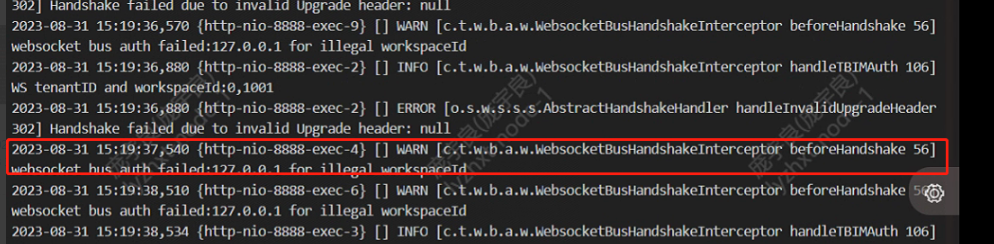
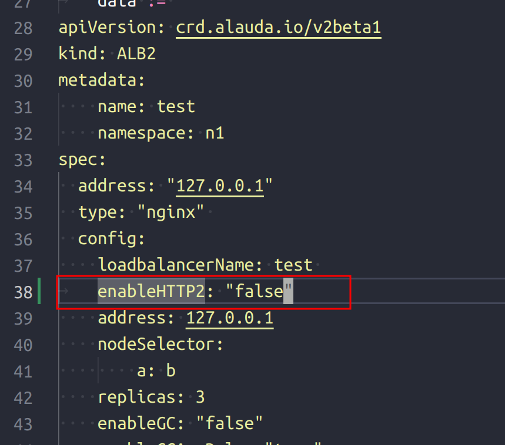

---
kind:
  - Troubleshooting
products:
  - Alauda Container Platform
  - Alauda DevOps
  - Alauda AI
  - Alauda Application Services
  - Alauda Service Mesh
  - Alauda Developer Portal
ProductsVersion:
  - 4.1.0,4.2.x
---
<!-- A type of document that involves encountering a fault, diagnosing it, performing root cause analysis, and providing solutions. -->

# 通过alb暴漏业务接受wss请求header丢失

业务侧日志提示请求头丢失

## Cause
- alb的nginx不支持websocket over http2导致header丢失

## Resolution
- 修改global上对应业务集群的alb的hr资源配置，添加enableHTTP2: fales

## [workaround]
- 临时关闭http2协议支持

## [Related Information]
**Screenshots**

- Environment: 3.10.2
- alb
- nginx
- websocket
- http2
- enableHTTP2
- Component: alb
- Page ID: 163067639
- Original Title: 通过alb暴漏业务接受wss请求header丢失
