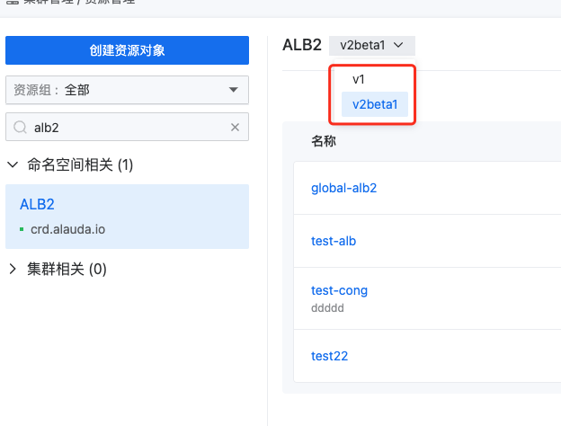

---
kind:
  - Troubleshooting
products:
  - Alauda Container Platform
  - Alauda DevOps
  - Alauda AI
  - Alauda Application Services
  - Alauda Service Mesh
  - Alauda Developer Portal
ProductsVersion:
  - 4.1.0,4.2.x
---
<!-- A type of document that involves encountering a fault, diagnosing it, performing root cause analysis, and providing solutions. -->

# 3.12.x版本alb资源更新注意事项

负载均衡页面加载异常 缺少端口和项目信息 无法更新ALB资源

## Cause
- alb2的apiVersion版本更新导致多版本并行
- 未针对v2beta1版本进行更新
- 使用kubectl get alb2命令操作的是v1版本

## Resolution
- 使用kubectl get alb2.v2beta1.crd.alauda.io进行查询和更新操作
- 参考还原ALB配置信息文档进行恢复

## [workaround]

## [Related Information]
**Screenshots**

- Environment: 3.12.0以及更高版本
- alb2.v2beta1.crd.alauda.io
- Component: alb
- Page ID: 163071468
- Original Title: 3.12.x版本alb资源更新注意事项
