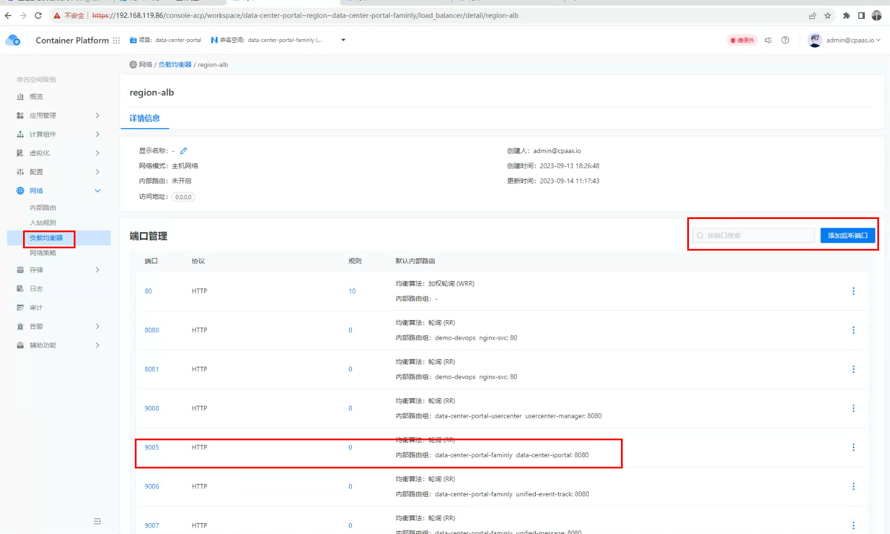
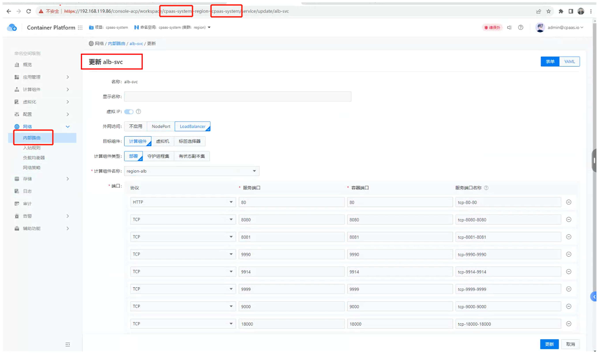

---
kind:
  - Troubleshooting
products:
  - Alauda Container Platform
  - Alauda DevOps
  - Alauda AI
  - Alauda Application Services
  - Alauda Service Mesh
  - Alauda Developer Portal
ProductsVersion:
  - 4.1.0,4.2.x
---
<!-- A type of document that involves encountering a fault, diagnosing it, performing root cause analysis, and providing solutions. -->

# 通过loadbalance方案暴露的alb

在负载均衡界面新增端口后无法提供对外访问能力

## Cause
- alb的svc未同步增加loadbalance端口配置

## Resolution
- 通过cpaas-system命名空间下的alb服务内部路由配置界面新增对应端口

## [workaround]

## [Related Information]
**Screenshots**

- Environment: 3.12.2
- alb服务
- svc
- cpaas-system命名空间
- loadbalance端口配置
- Component: alb
- Page ID: 163084360
- Original Title: 通过loadbalance方案暴露的alb-在alb新增端口后，对应的alb的svc中loadbalance新增端口方法
