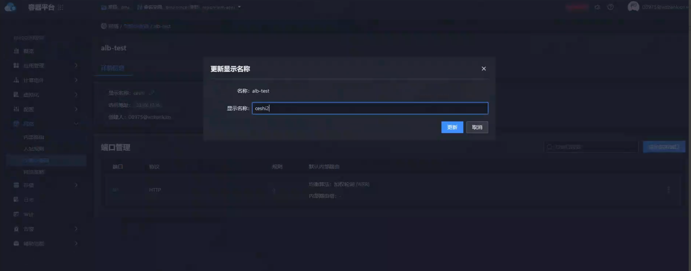
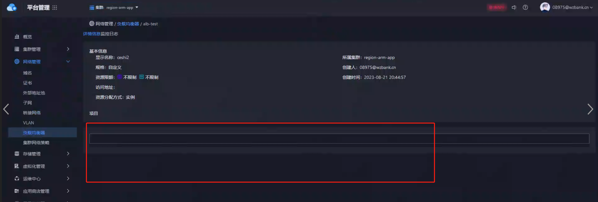

---
kind:
  - Troubleshooting
products:
  - Alauda Container Platform
  - Alauda DevOps
  - Alauda AI
  - Alauda Application Services
  - Alauda Service Mesh
  - Alauda Developer Portal
ProductsVersion:
  - 4.1.0,4.2.x
---
<!-- A type of document that involves encountering a fault, diagnosing it, performing root cause analysis, and providing solutions. -->

# 3.12.1

在容器中心更新ALB备注后，ALB界面显示异常

## Cause
- 3.12.1版本存在该缺陷

## Resolution
- 升级到3.12.2版本修复
- 在当前3.12.1版本应用hotfix

## [workaround]

## [Related Information]
**Screenshots**
1、
2、
- Environment: 3.12.1
- alb管理界面
- Component: alb
- Page ID: 178228198
- Original Title: 3.12.1-容器平台-在容器中心更新alb导致平台管理的alb显示异常
