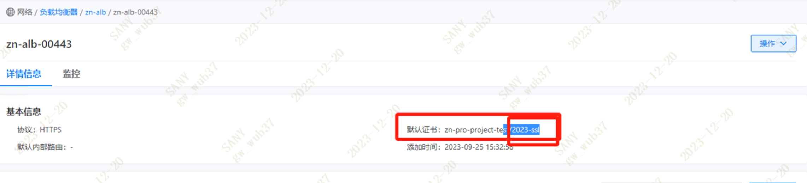

---
kind:
  - Troubleshooting
products:
  - Alauda Container Platform
  - Alauda DevOps
  - Alauda AI
  - Alauda Application Services
  - Alauda Service Mesh
  - Alauda Developer Portal
ProductsVersion:
  - 4.1.0,4.2.x
---
<!-- A type of document that involves encountering a fault, diagnosing it, performing root cause analysis, and providing solutions. -->

# 3.12.2

haproxy报错503，后端服务不可用 alb的nginx容器报错证书文件缺失 alb容器日志显示证书secret名称不匹配

## Cause
- haproxy使用的证书secret名称(ssl-2023)与alb服务期望的证书名称(2023-ssl)不一致

## Resolution
- 通过管理界面更新443端口使用的证书，保持两边secret名称一致

## [workaround]

## [Related Information]
**Screenshots**

- Environment: 3.12.2
- cpaas_frontend-2_443
- cpaas-2_443
- 2023-ssl
- ssl-2023
- alb服务
- nginx容器
- Component: alb
- Page ID: 178228434
- Original Title: 3.12.2-haproxy设置http模式对应alb的443端口负载-haproxy报错：cpaas_frontend-2_443~ cpaas-2_443 503
