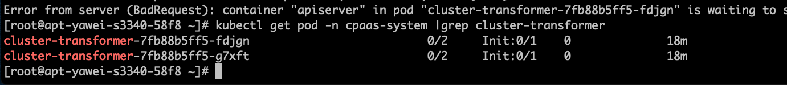
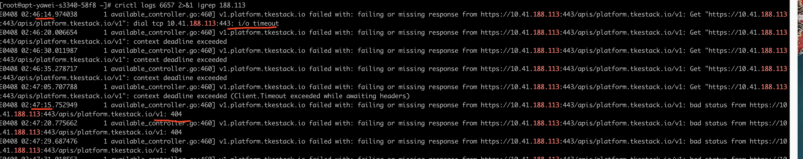
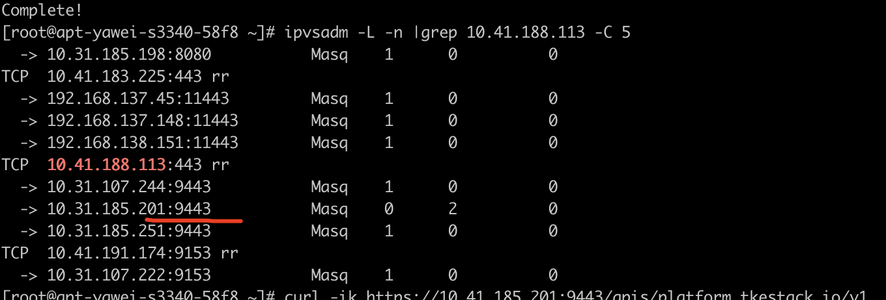
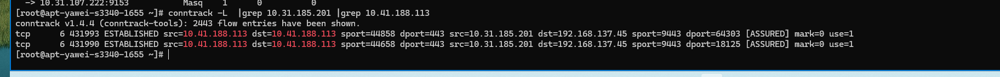

---
kind:
  - Troubleshooting
products:
  - Alauda Container Platform
  - Alauda DevOps
  - Alauda AI
  - Alauda Application Services
  - Alauda Service Mesh
  - Alauda Developer Portal
ProductsVersion:
  - 4.1.0,4.2.x
---
<!-- A type of document that involves encountering a fault, diagnosing it, performing root cause analysis, and providing solutions. -->

# ipvs weight为0持久连接不释放导致断电测试后偶现pod起不来

cluster-transformer的pod起不来 api-server访问cluster-transformer的svc IP返回404错误 ipvs规则中存在weight为0但activeconn不为0的后端

## Cause
- 断电测试导致持久连接未正常释放
- 新pod复用旧pod的IP和端口(9443)
- ipvs持续将流量导向weight为0的后端
- conntrack超时时间过长(432000秒)

## Resolution
- 删除ipvs中weight为0的后端
- 设置net.ipv4.vs.expire_quiescent_template=1
- 设置net.ipv4.vs.conn_reuse_mode=1

## [workaround]
- 手动清理ipvs规则中weight为0的后端

## [Related Information]
**Screenshots**

- ipvs
- conntrack
- cluster-transformer的svc
- 9443端口
- net.ipv4.vs.conn_reuse_mode
- net.ipv4.vs.conntrack
- net.ipv4.vs.expire_nodest_conn
- net.ipv4.vs.expire_quiescent_template
- Component: ALB
- Page ID: 201460215
- Original Title: ipvs weight为0持久连接不释放导致断电测试后偶现pod起不来
