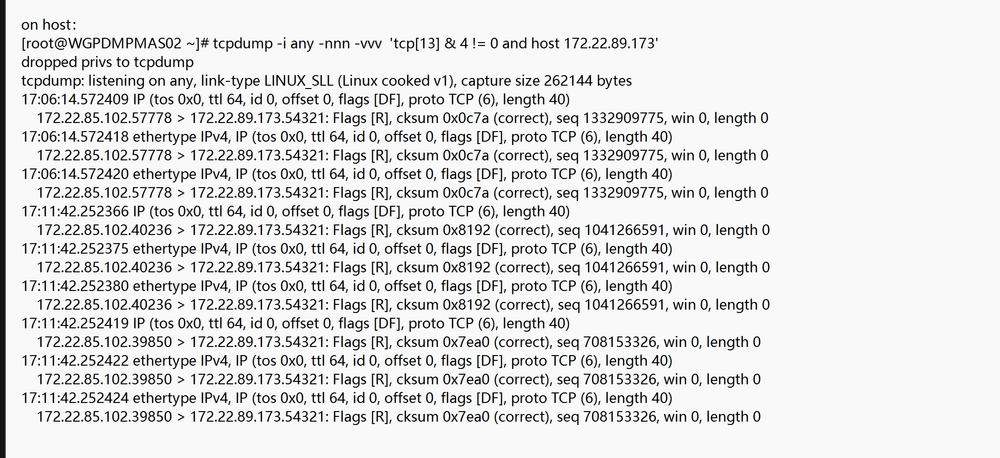
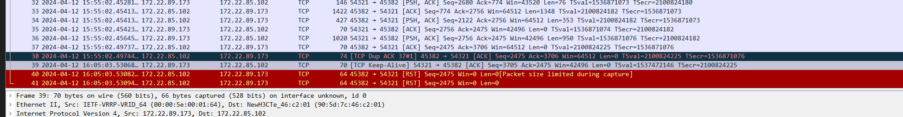
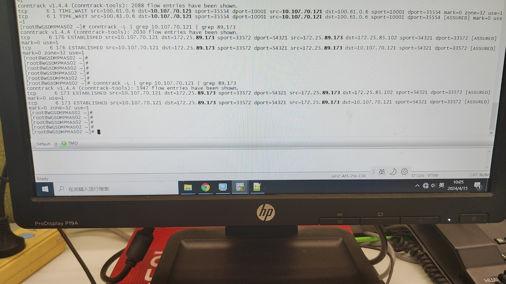

---kind:   - Troubleshootingproducts:    - Alauda Container Platform   - Alauda DevOps   - Alauda AI   - Alauda Application Services   - Alauda Service Mesh   - Alauda Developer PortalProductsVersion:   - 4.1.0,4.2.x---<!-- A type of document that involves encountering a fault, diag...it, performing root cause analysis, and providing solutions. --># 中外汇 从集群内访问集群外数据库链路断开周期性收到节点发给数据库的RST报文 数据库与应用链路断开时间与RST报文时间吻合 主机conntrack表项超时时间异常（173秒）## Cause- ALB 3.8.1版本存在bug导致nf_conntrack_tcp_timeout_established被错误配置为180秒## Resolution- 执行命令恢复超时时间: sysctl -w net.netfilter.nf_conntrack_tcp_timeout_established=432000- 升级ALB版本## [workaround]## [Related Information]**Screenshots**- Environment: 统信UOS v20, ACP 3.8.3, kube-ovn 1.8.15- nf_conntrack_tcp_timeout_established- conntrack- kube-ovn- ALB 3.8.1- ovs v2.15.2- Component: alb- Page ID: 202966517- Original Title: 中外汇 从集群内访问集群外数据库链路断开