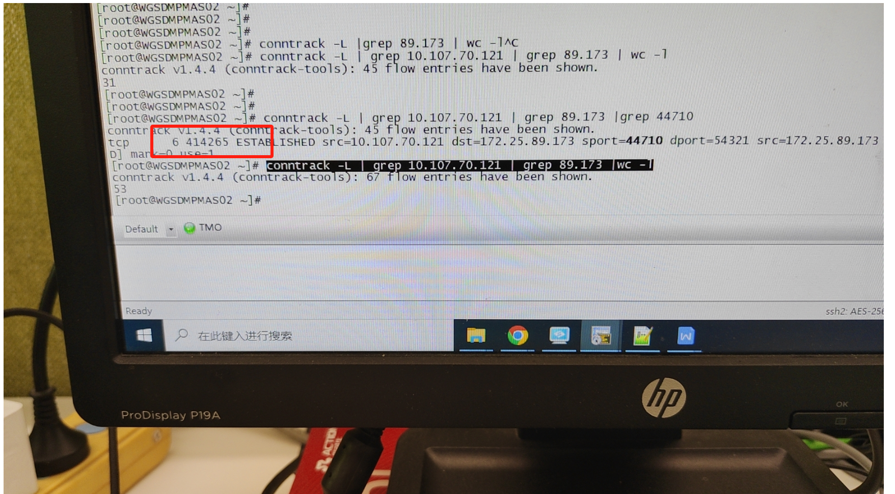

---
kind:
  - Troubleshooting
products:
  - Alauda Container Platform
  - Alauda DevOps
  - Alauda AI
  - Alauda Application Services
  - Alauda Service Mesh
  - Alauda Developer Portal
ProductsVersion:
  - 4.1.0,4.2.x
---
<!-- A type of document that involves encountering a fault, diagnosing it, performing root cause analysis, and providing solutions. -->

# 中外汇 从集群内访问集群外数据库链路断开

周期性收到节点发送给数据库的RST报文，与数据库断开时间吻合 主机上conntrack表项的超时时间异常（约180秒），远低于默认值432000秒

## Cause
- alb 3.8.1版本存在bug导致nf_conntrack_tcp_timeout_established参数被错误配置为180秒

## Resolution
- 修正conntrack established超时时间：sysctl -w net.netfilter.nf_conntrack_tcp_timeout_established=432000
- 升级alb版本

## [workaround]

## [Related Information]
**Screenshots**

- Environment: 统信UOS v20 | kube-ovn 1.8.15 | acp 3.8.3
- conntrack
- nf_conntrack_tcp_timeout_established
- kube-ovn
- alb
- Component: alb
- Page ID: 202966517
- Original Title: 中外汇 从集群内访问集群外数据库链路断开
