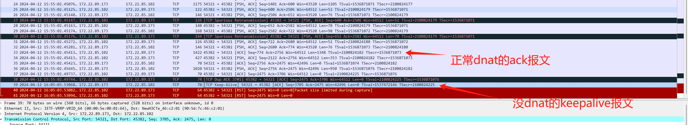
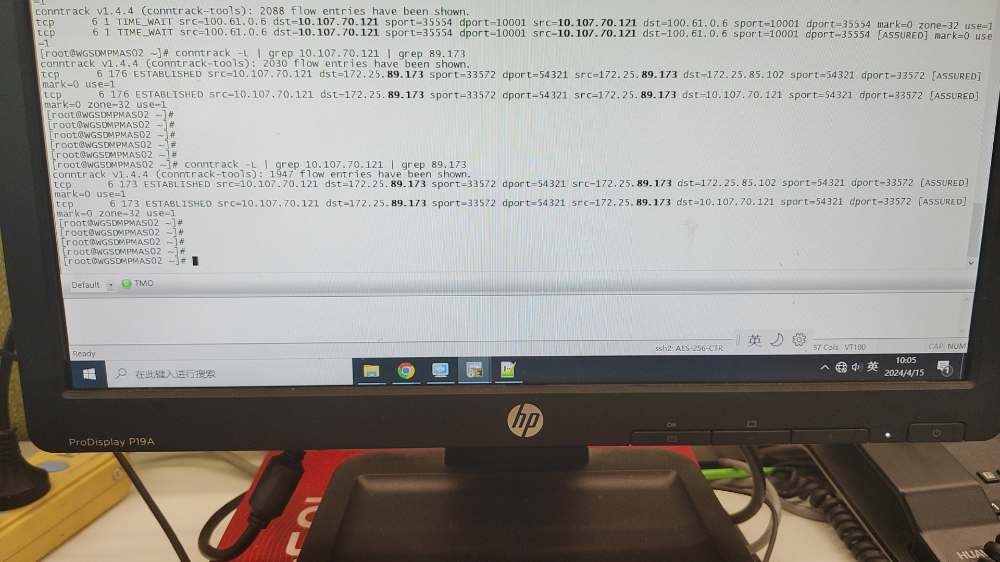
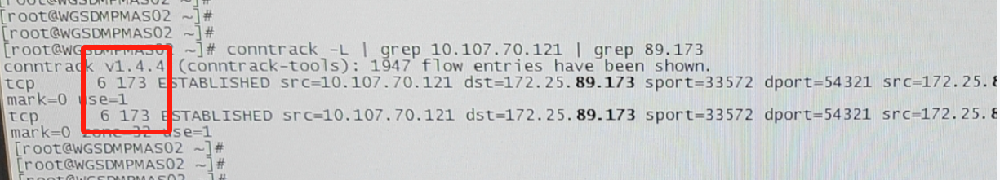

---
kind:
  - Troubleshooting
products:
  - Alauda Container Platform
  - Alauda DevOps
  - Alauda AI
  - Alauda Application Services
  - Alauda Service Mesh
  - Alauda Developer Portal
ProductsVersion:
  - 4.1.0,4.2.x
---
<!-- A type of document that involves encountering a fault, diagnosing it, performing root cause analysis, and providing solutions. -->

# 应用与数据库服务器连接断开，主机查看发现由reset包导致数据库连接断开

应用与数据库服务器连接断开 主机上发现由reset包导致数据库连接断开 容器内未发现reset包

## Cause
- 数据库发送的keepalive报文回复未做DNAT，导致主机直接返回reset包
- 主机conntrack的tcp_timeout_established参数被alb修改为180s，低于数据库600s的keepalive间隔

## Resolution
- 升级到TKE 3.8.2版本(已优化alb不再修改该参数)

## [workaround]
- 临时调整主机conf_conntrack_tcp_timeout_established参数至大于600s(如7200)

## [Related Information]
**Screenshots**

- Environment: TKE 3.8.1, OVN网络, 金仓数据库(端口54321), 容器主机IP:172.22.85.102, 数据库VIP:172.22.89.173, pod:dw-jss-mdp-695dcbd9c4-d5ggm
- 54321
- 172.22.89.173
- conntrack
- conf_conntrack_tcp_timeout_established
- alb
- Component: alb
- Page ID: 202967213
- Original Title: 容器平台-网络-应用与数据库服务器连接断开，主机查看发现由reset包导致数据库连接断开
