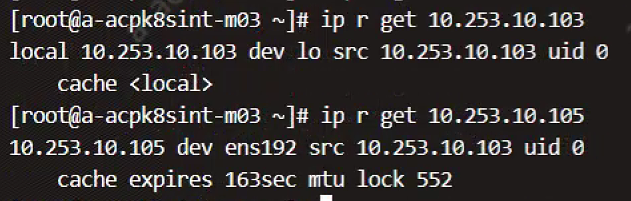

---kind:   - Troubleshootingproducts:    - Alauda Container Platform   - Alauda DevOps   - Alauda AI   - Alauda Application Services   - Alauda Service Mesh   - Alauda Developer PortalProductsVersion:   - 4.1.0,4.2.x---<!-- A type of document that involves encountering a fault, diag...it, performing root cause analysis, and providing solutions. --># 通过nginx+alb访问页面缓慢间歇性加载超时 TCP PSH包未到达nginx节点 路由缓存显示mtu 552## Cause- net.ipv4.ip_no_pmtu_disc=1导致PMTU未启用- 路由mtu异常## Resolution- 临时移除故障节点- 设置sysctl net.ipv4.ip_no_pmtu_disc=0## [workaround]## [Related Information]**Screenshots**- Environment: Kubernetes集群，Calico CNI- metallb- alb- nginx- nodeport- net.ipv4.ip_no_pmtu_disc- Component: alb- Page ID: 225968892- Original Title: 通过nginx+alb访问页面缓慢