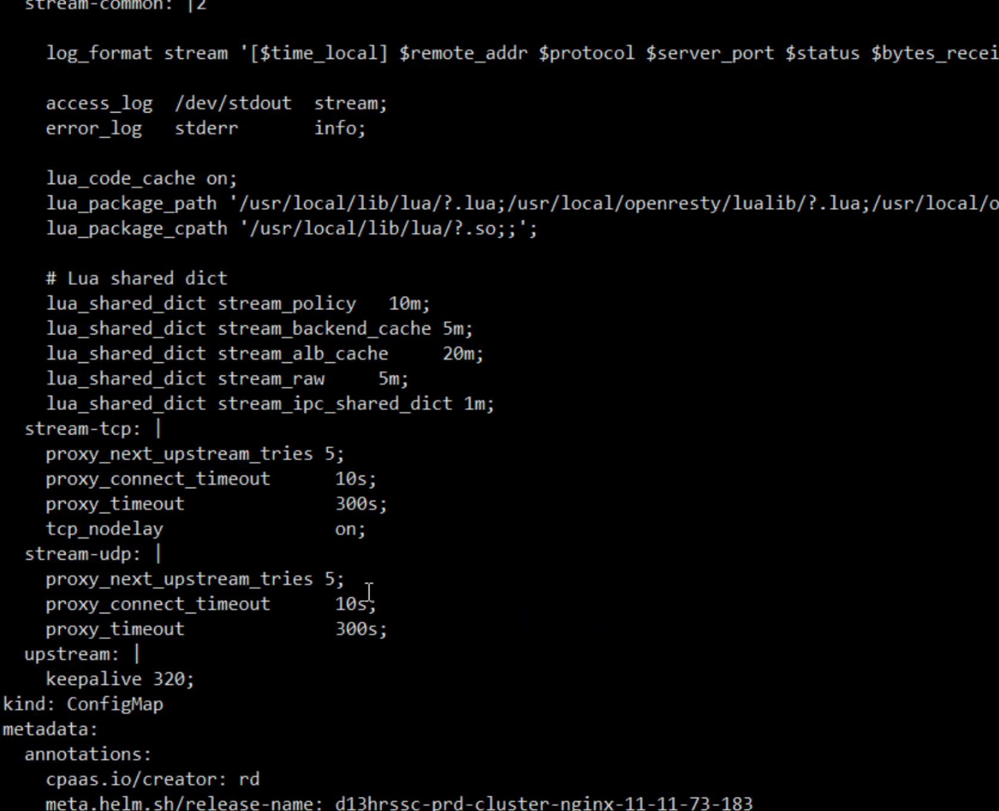
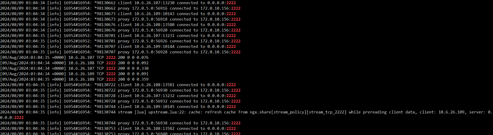
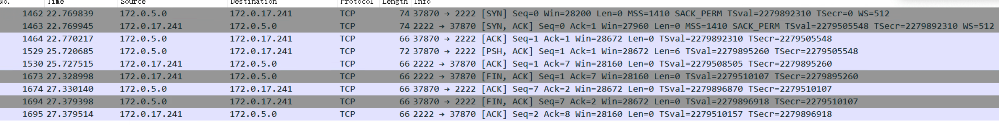
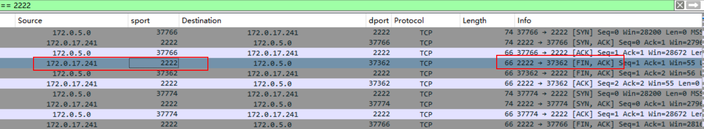

---
kind:
  - Troubleshooting
products:
  - Alauda Container Platform
  - Alauda DevOps
  - Alauda AI
  - Alauda Application Services
  - Alauda Service Mesh
  - Alauda Developer Portal
ProductsVersion:
  - 4.1.0,4.2.x
---
<!-- A type of document that involves encountering a fault, diagnosing it, performing root cause analysis, and providing solutions. -->

# 外部访问alb配置的tcp协议端口频繁断开链接

外部应用通过alb连接的tcp协议端口频繁断开（2秒断开）

## Cause
- 业务逻辑需要获取真实客户端IP进行记录，ALB代理导致后端获取到的是负载均衡器地址而非真实客户端IP

## Resolution
- 将服务部署模式改为hostNetwork直接暴露真实IP

## [workaround]

## [Related Information]
**Screenshots**

- Environment: 通用版本
- alb配置文件
- nginx日志
- tcpdump抓包
- hostnetwork模式
- Component: alb
- Page ID: 228558718
- Original Title: 外部访问alb配置的tcp协议端口频繁断开链接
