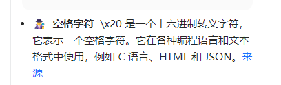

---
kind:
  - Troubleshooting
products:
  - Alauda Container Platform
  - Alauda DevOps
  - Alauda AI
  - Alauda Application Services
  - Alauda Service Mesh
  - Alauda Developer Portal
ProductsVersion:
  - 4.1.0,4.2.x
---
<!-- A type of document that involves encountering a fault, diagnosing it, performing root cause analysis, and providing solutions. -->

# v3.12

生产环境业务服务访问异常，没有请求到对应的服务 nginx日志出现错误信息：upstream sent invalid header: "\x20..." while reading response header from upstream

## Cause
- 业务服务跨域配置(CORS)响应头包含非法字符(空格)

## Resolution
- 修正业务服务跨域配置，去除响应头中的非法空格字符

## [workaround]

## [Related Information]
**Screenshots**

- Environment: 3.12.1
- alb
- nginx组件
- 跨域配置头
- Component: ALB
- Page ID: 231113000
- Original Title: v3.12-容器平台-生产环境业务服务访问异常
