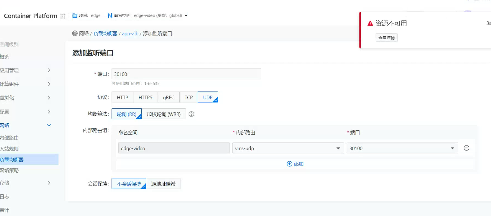
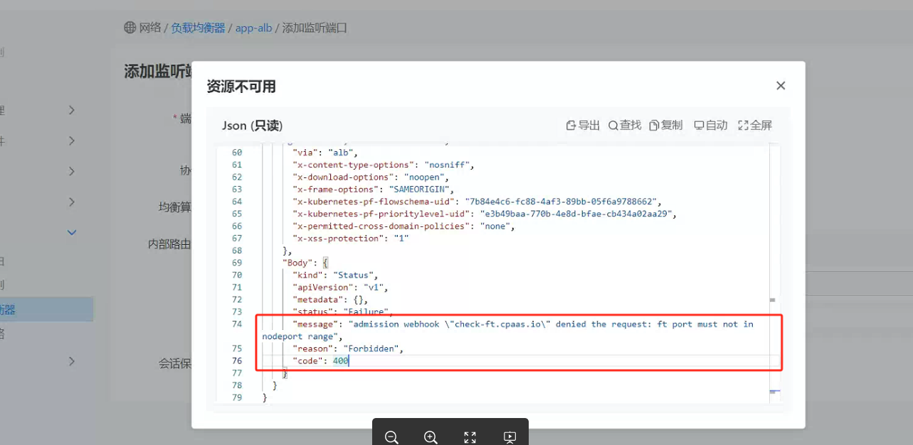
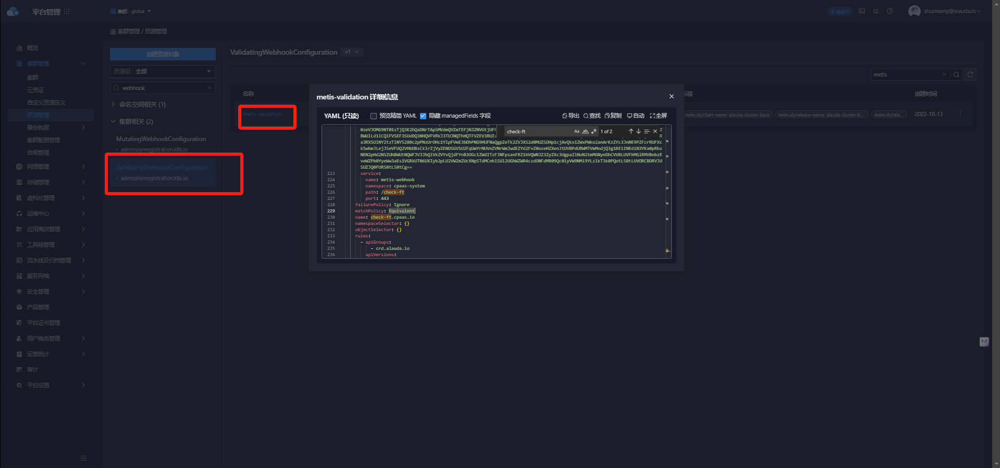
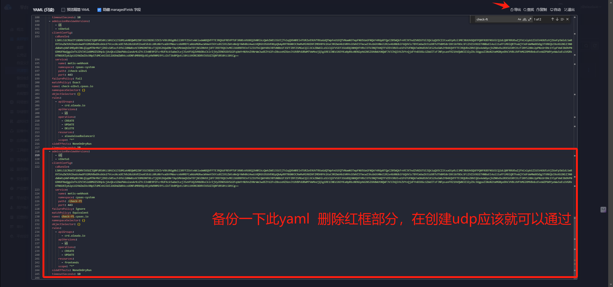

---
kind:
  - Troubleshooting
products:
  - Alauda Container Platform
  - Alauda DevOps
  - Alauda AI
  - Alauda Application Services
  - Alauda Service Mesh
  - Alauda Developer Portal
ProductsVersion:
  - 4.1.0,4.2.x
---
<!-- A type of document that involves encountering a fault, diagnosing it, performing root cause analysis, and providing solutions. -->

# 负载均衡创建UDP端口报错

创建UDP端口时出现webhook拦截报错

## Cause
- 3.12.4版本存在NodePort端口范围(30000-32767)限制不全问题

## Resolution
- 删除global集群ValidatingWebhookConfiguration资源中的metis-validation配置

## [workaround]
- 通过修改metis-validation的webhook配置临时规避限制

## [Related Information]
**Screenshots**

- Environment: 3.12.4
- ValidatingWebhookConfiguration
- metis-validation
- 30000-32767
- Component: ALB
- Page ID: 231116446
- Original Title: 负载均衡创建UDP端口报错-端口限制导致
