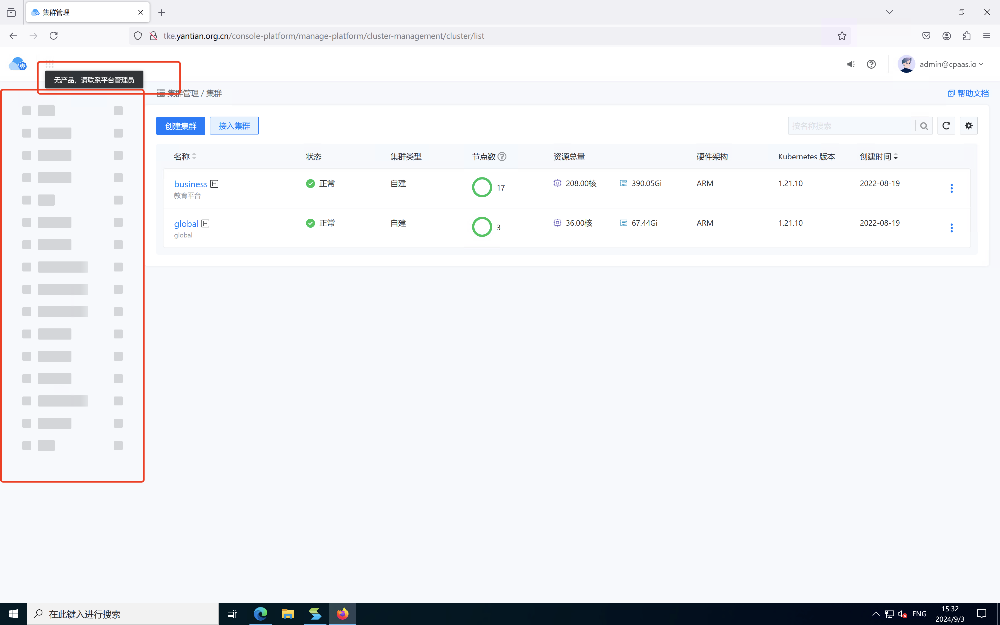
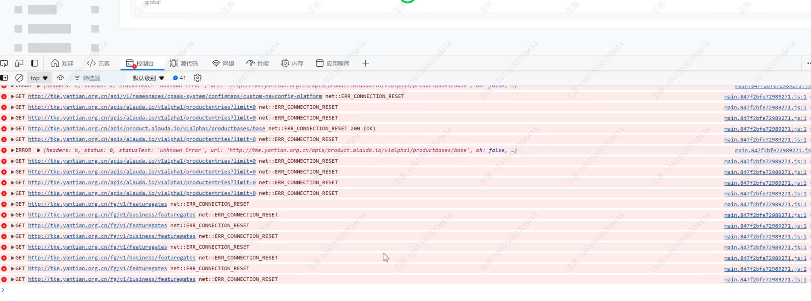
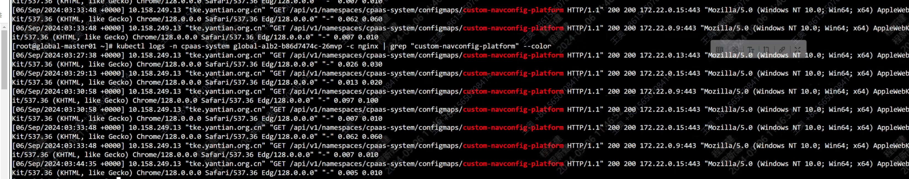

---
kind:
  - Troubleshooting
products:
  - Alauda Container Platform
  - Alauda DevOps
  - Alauda AI
  - Alauda Application Services
  - Alauda Service Mesh
  - Alauda Developer Portal
ProductsVersion:
  - 4.1.0,4.2.x
---
<!-- A type of document that involves encountering a fault, diagnosing it, performing root cause analysis, and providing solutions. -->

# 平台页面菜单不显示

平台界面菜单不显示 浏览器访问HTTP接口显示network_connection_reset

## Cause
- 负载均衡器(如F5)对HTTP明文传输协议存在网络策略限制

## Resolution
- 检查global-alb负载均衡器针对HTTP协议的网络策略配置
- 改用HTTPS协议访问平台

## [workaround]
- 通过HTTPS协议访问平台

## [Related Information]
**Screenshots**

- Environment: 3.8.1
- global-alb
- F5负载均衡器
- nginx
- HTTP协议
- HTTPS协议
- Component: ALB
- Page ID: 233866420
- Original Title: 容器平台-平台页面菜单不显示-88864
