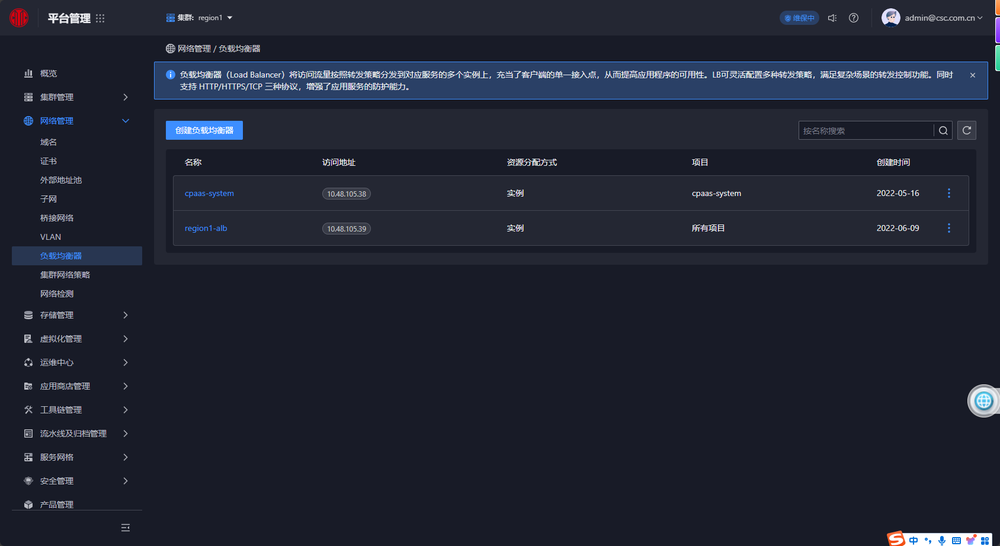
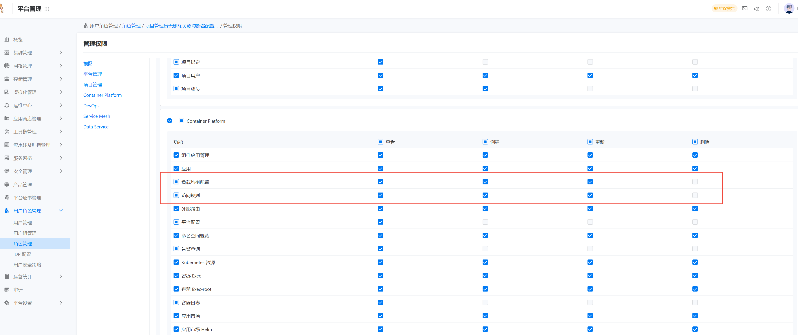
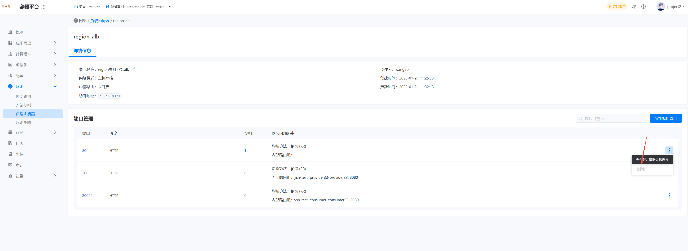

---
kind:
  - Troubleshooting
products:
  - Alauda Container Platform
  - Alauda DevOps
  - Alauda AI
  - Alauda Application Services
  - Alauda Service Mesh
  - Alauda Developer Portal
ProductsVersion:
  - 4.1.0,4.2.x
---
<!-- A type of document that involves encountering a fault, diagnosing it, performing root cause analysis, and providing solutions. -->

# 为什么a项目管理员可以删除b项目在负载均衡里面的规则

a 项目管理员能够删除 b 项目在负载均衡中的规则

## Cause
- 负载均衡器被分配给所有项目使用，项目管理员拥有对该负载均衡器整体的操作权限，但只能看到本项目端口配置的规则

## Resolution
- 创建受限角色：复制项目管理员角色并创建新角色
- 设置权限限制：取消新角色的容器平台负载均衡配置和访问规则的删除权限
- 分配受限角色：将新角色分配给用户

## [workaround]

## [Related Information]
**Screenshots**

3. **分配受限角色**：将这个新创建且权限受限的角色分配给对应的用户。这样，该用户就无法删除对应负载均衡器的端口规则，避免了跨项目误删规则的问题。
4. 
- Environment: 3.12.1
- 负载均衡器
- 角色管理页面
- 负载均衡配置
- 访问规则删除权限
- Component: ALB
- Page ID: 265652901
- Original Title: 基础架构-为什么a项目管理员可以删除b项目在负载均衡里面的规则-101140
