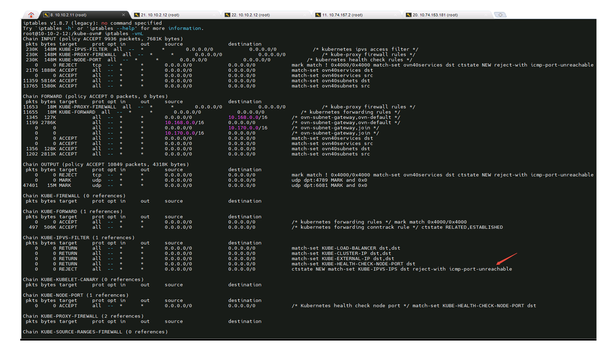
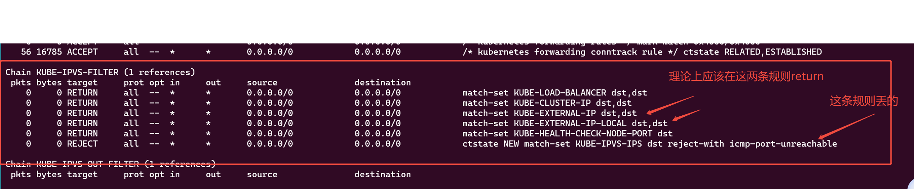
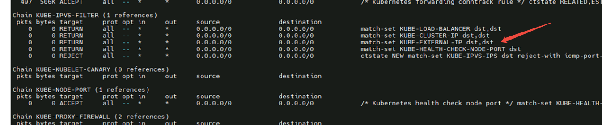
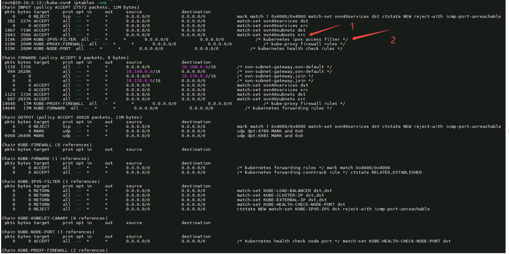

---kind:   - Troubleshootingproducts:    - Alauda Container Platform   - Alauda DevOps   - Alauda AI   - Alauda Application Services   - Alauda Service Mesh   - Alauda Developer PortalProductsVersion:   - 4.1.0,4.2.x---<!-- A type of document that involves encountering a fault, diag...it, performing root cause analysis, and providing solutions. --># 国君期货 pod 内访问虚拟外部负载均衡 IP 不通Pod内访问LoadBalancer Service的External IP时通时不通## Cause- kube-proxy的bug导致缺少KUBE-EXTERNAL-IP-LOCAL iptables规则- kube-proxy与kube-ovn启动顺序影响iptables规则顺序## Resolution- 升级Kubernetes至1.28及以上版本## [workaround]## [Related Information]**Screenshots**- Environment: Kubernetes 1.27.7, ACP 3.14.2- kube-proxy- kube-ovn- KUBE-EXTERNAL-IP-LOCAL- KUBE-IPVS-FILTER- externalTrafficPolicy- Component: ALB- Page ID: 276037913- Original Title: 国君期货 pod 内访问虚拟外部负载均衡 IP 不通