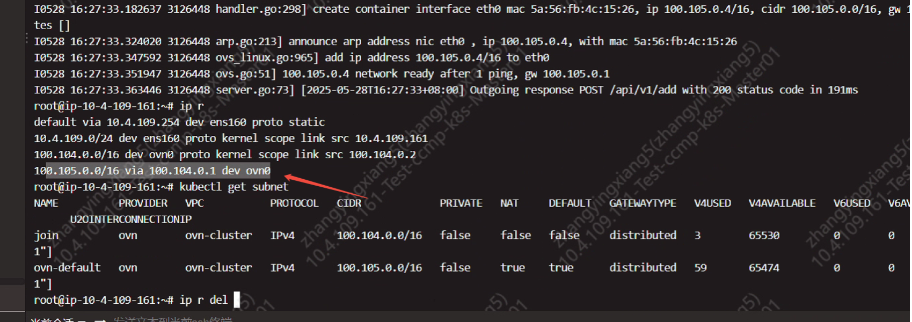

---
kind:
  - Troubleshooting
products:
  - Alauda Container Platform
  - Alauda DevOps
  - Alauda AI
  - Alauda Application Services
  - Alauda Service Mesh
  - Alauda Developer Portal
ProductsVersion:
  - 4.1.0,4.2.x
---
<!-- A type of document that involves encountering a fault, diagnosing it, performing root cause analysis, and providing solutions. -->

# 开了集群全隔离策略后，通过alb不管四层七层都无法访问了

开启集群网络策略后，通过alb访问内部pod都不通 节点到pod的流量不通，src IP为ovn0的IP被ACL拦截

## Cause
- 旧版本路由规则导致访问pod时src IP使用ovn0的IP，与集群网络策略ACL放行的节点IP不匹配

## Resolution
- 临时方案：手动删除旧路由条目并重启kube-ovn-cni
- 代码方案：升级kube-ovn替换路由规则(参考https://github.com/kubeovn/kube-ovn/pull/5287)

## [workaround]
- 删除错误路由条目: 100.105.0.0/16 via 100.104.0.1 dev ovn0 src 10.4.109.161
- 重启kube-ovn-cni组件

## [Related Information]
**Screenshots**

- Environment: CNI版本：kube-ovn 1.12.29；其他信息：acp 3.18.1
- kube-ovn-cni
- ovn0设备
- 集群网络策略ACL
- alb配置
- 节点路由表
- Component: alb
- Page ID: 300384318
- Original Title: 开了集群全隔离策略后，通过alb不管四层七层都无法访问了
