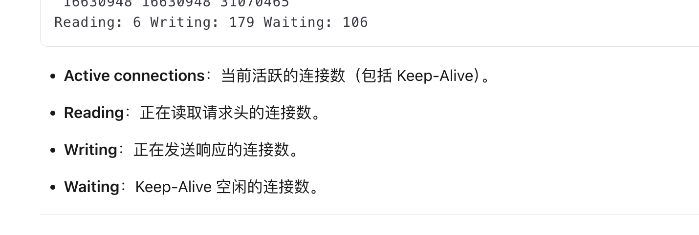

---
kind:
  - Troubleshooting
products:
  - Alauda Container Platform
  - Alauda DevOps
  - Alauda AI
  - Alauda Application Services
  - Alauda Service Mesh
  - Alauda Developer Portal
ProductsVersion:
  - 4.1.0,4.2.x
---
<!-- A type of document that involves encountering a fault, diagnosing it, performing root cause analysis, and providing solutions. -->

# alb http链接监控

JIRA Jira：

## Cause

## Resolution

## [workaround]

## [Related Information]
**Screenshots**

- Environment: 3.16.2
- ngx_var.connections_reading
- ngx_var.connections_waiting
- ngx_var.connections_writing
- ngx_var.connections_active
- alb metrics
- https://confluence.alauda.cn/display/cp/alb+metrics
- Component: alb
- Page ID: 323682777
- Original Title: 容器平台-网络-ALB-alb http链接监控-114007
