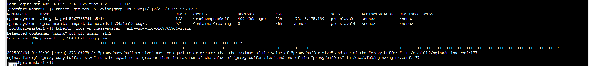
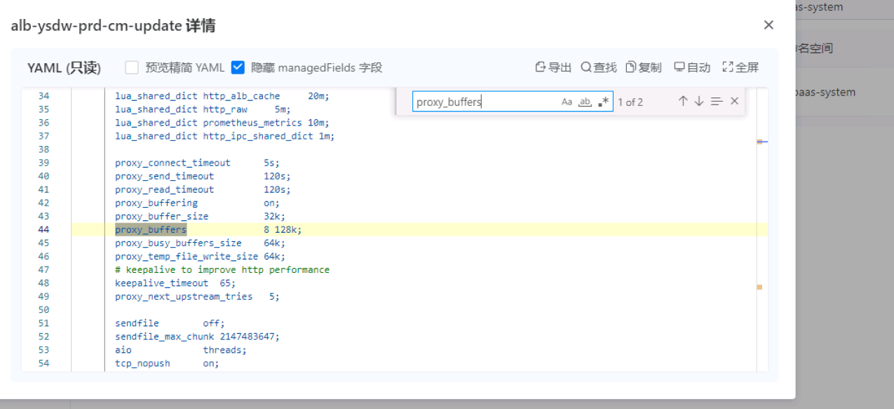

---
kind:
  - Troubleshooting
products:
  - Alauda Container Platform
  - Alauda DevOps
  - Alauda AI
  - Alauda Application Services
  - Alauda Service Mesh
  - Alauda Developer Portal
ProductsVersion:
  - 4.1.0,4.2.x
---
<!-- A type of document that involves encountering a fault, diagnosing it, performing root cause analysis, and providing solutions. -->

# ALB 配置变更后 Nginx 日志报错buffer_proxy 问题解决

Nginx报错：`proxy_busy_buffers_size必须大于或等于proxy_buffer_size和proxy_buffers中的最大值` 错误发生在`/etc/alb2/nginx/nginx.conf`文件的第177行 点击更新`alb cm - pdate``可暂时恢复，但之后问题会再次出现

## Cause
- `proxy_busy_buffers_size`的值小于`proxy_buffer_size`和`proxy_buffers`中的最大值，导致Nginx无法启动

## Resolution
- 调整ALB对应ConfigMap中的`proxy_busy_buffers_size`至至少128k

## [workaround]
- 执行``alb cm - pdate``更新操作以临时恢复

## [Related Information]
**Screenshots**

- Environment: 通用
- proxy_busy_buffers_size
- proxy_buffer_size
- proxy_buffers
- /etc/alb2/nginx/nginx.conf
- ALB ConfigMap
- Component: alb
- Page ID: 325910571
- Original Title: 容器平台-ALB 配置变更后 Nginx 日志报错buffer_proxy 问题解决-114292
