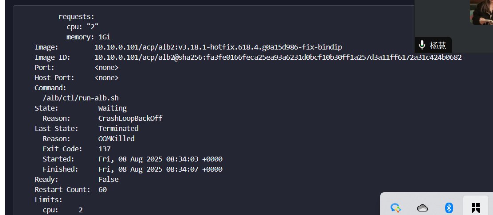

---kind:   - Troubleshootingproducts:    - Alauda Container Platform   - Alauda DevOps   - Alauda AI   - Alauda Application Services   - Alauda Service Mesh   - Alauda Developer PortalProductsVersion:   - 4.1.0,4.2.x---<!-- A type of document that involves encountering a fault, diag...it, performing root cause analysis, and providing solutions. --># alb无法访问后端服务alb无法访问后端服务 upstream timed out (110: Operation timed out) alb2容器oom重启## Cause- alb2容器内存不足- 集群负载均衡器规则接近12000条导致资源需求增加## Resolution- 扩容alb实例内alb2容器的内存limit到4Gi## [workaround]## [Related Information]**Screenshots**- Environment: 3.18.1- alb2容器- 负载均衡器规则- 内存limit配置- Component: alb- Page ID: 330465801- Original Title: 容器平台-网络-ALB-alb无法访问后端服务-114760