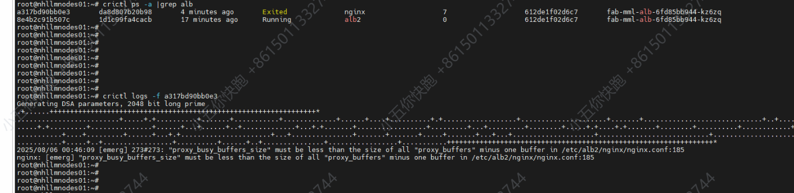

---kind:   - Troubleshootingproducts:    - Alauda Container Platform   - Alauda DevOps   - Alauda AI   - Alauda Application Services   - Alauda Service Mesh   - Alauda Developer PortalProductsVersion:   - 4.1.0,4.2.x---<!-- A type of document that involves encountering a fault, diag...it, performing root cause analysis, and providing solutions. --># 集群alb故障alb组件被驱逐事件 alb nginx容器启动异常 alb配置文件proxy_buffer配置异常## Cause- /目录磁盘使用率超过85%触发kubelet驱逐- alb配置文件存在异常proxy_buffer配置## Resolution- 清理磁盘空间解决驱逐问题- 还原alb默认配置- 更新alb2资源并重启alb组件## [workaround]## [Related Information]**Screenshots**- Environment: 3.18.1- kubelet驱逐机制- ALB组件- nginx容器- proxy_buffer配置- 日志存储插件- Component: alb- Page ID: 330465892- Original Title: 容器平台-网络-ALB-集群alb故障-114496