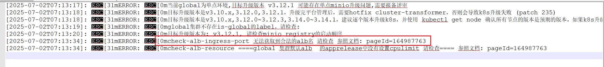

---kind:   - Troubleshootingproducts:    - Alauda Container Platform   - Alauda DevOps   - Alauda AI   - Alauda Application Services   - Alauda Service Mesh   - Alauda Developer PortalProductsVersion:   - 4.1.0,4.2.x---<!-- A type of document that involves encountering a fault, diag...it, performing root cause analysis, and providing solutions. --># checkcheck-alb-ingress-port 无法获取到合法的alb名## Cause- 创建checklist容器时未挂载kubecfg## Resolution- 重新执行正确的容器创建流程并挂载kubecfg## [workaround]## [Related Information]**Screenshots**- Environment: v3.12.0-112201- check-alb-ingress-port- checklist容器- kubecfg- ALB Ingress控制器- Component: alb- Page ID: 330465909- Original Title: 容器平台-网络-ALB-check-alb-ingress-port 无法获取到合法的alb名 环境v3.12.0-112201