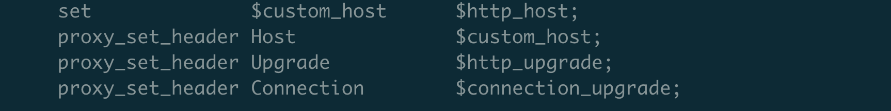

---
kind:
  - Troubleshooting
products:
  - Alauda Container Platform
  - Alauda DevOps
  - Alauda AI
  - Alauda Application Services
  - Alauda Service Mesh
  - Alauda Developer Portal
ProductsVersion:
  - 4.1.0,4.2.x
---
<!-- A type of document that involves encountering a fault, diagnosing it, performing root cause analysis, and providing solutions. -->

# 业务上要使用websocket，alb如何开启支持websocket

业务无法使用websocket协议

## Cause
- ALB未正确配置websocket支持

## Resolution
- 1. 执行命令查找对应ALB的ConfigMap: kubectl get cm -n cpaas-system [负载均衡器名称]
- 2. 编辑该ConfigMap配置文件
- 3. 重启对应的ALB pod

## [workaround]

## [Related Information]
**Screenshots**

- Environment: 3.12.2
- alb配置文件
- cpaas-system命名空间
- kubectl get cm命令
- ConfigMap
- Component: alb
- Page ID: 330465916
- Original Title: 容器平台-网络-ALB-业务上要使用websocket，alb如何开启支持websocket-112399
