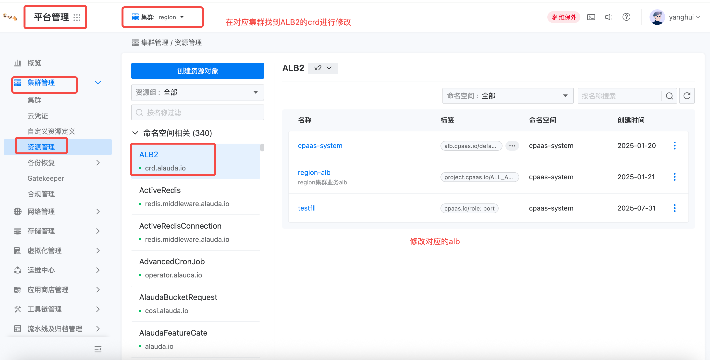
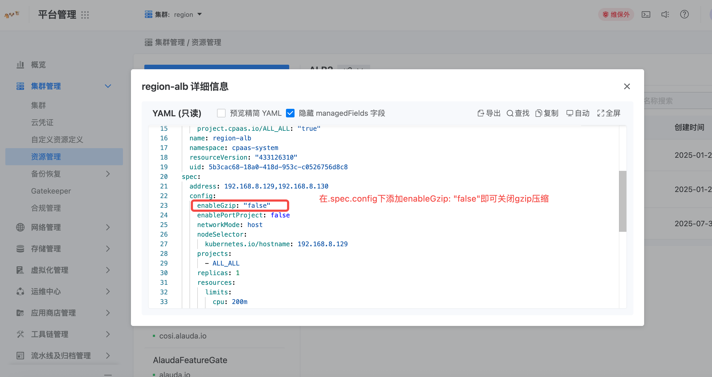

---kind:   - Troubleshootingproducts:    - Alauda Container Platform   - Alauda DevOps   - Alauda AI   - Alauda Application Services   - Alauda Service Mesh   - Alauda Developer PortalProductsVersion:   - 4.1.0,4.2.x---<!-- A type of document that involves encountering a fault, diag...it, performing root cause analysis, and providing solutions. --># alb是否有控制httpq请求中content返回的请求体接收到的是乱码## Cause- ALB默认启用了gzip压缩## Resolution- 通过ALB控制台修改配置关闭gzip压缩功能## [workaround]## [Related Information]**Screenshots**- Environment: 3.16.2- alb配置项- gzip- Component: alb- Page ID: 330466116- Original Title: 容器平台-网络-alb是否有控制httpq请求中content-type:gzip的配置-115051