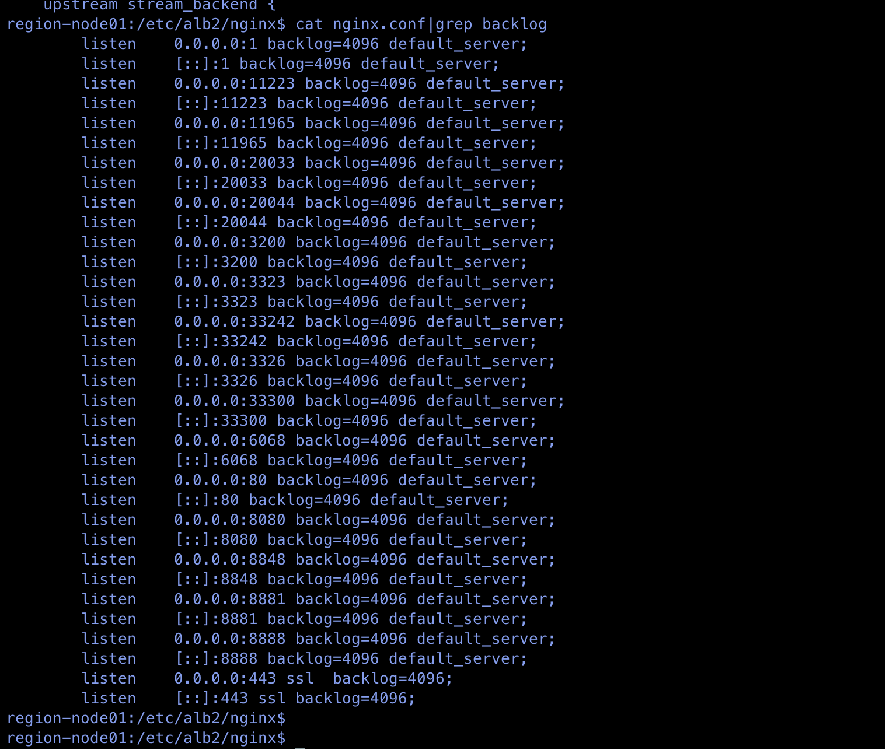

---
kind:
  - Troubleshooting
products:
  - Alauda Container Platform
  - Alauda DevOps
  - Alauda AI
  - Alauda Application Services
  - Alauda Service Mesh
  - Alauda Developer Portal
ProductsVersion:
  - 4.1.0,4.2.x
---
<!-- A type of document that involves encountering a fault, diagnosing it, performing root cause analysis, and providing solutions. -->

# 如何调整负载均衡器ALB中默认的backlog配置

## 环境信息 适用版本：3.12.2，3.18.2

## Cause

## Resolution
- 3.12.2版本：通过平台界面修改ALB资源的config字段增加backlog参数，检查/etc/alb2/nginx/nginx.conf配置生效
- 3.18.2版本：通过kubectl edit alb2修改spec.config.backlog参数，检查/etc/alb2/nginx/nginx.conf配置生效

## [workaround]

## [Related Information]
**Screenshots**

- Environment: 3.12.2,3.18.2
- ALB资源
- /etc/alb2/nginx/nginx.conf
- kubectl edit alb2
- spec.config.backlog
- Component: ALB
- Page ID: 338919620
- Original Title: 容器平台-网络-ALB-如何调整负载均衡器ALB中默认的backlog配置-115699
